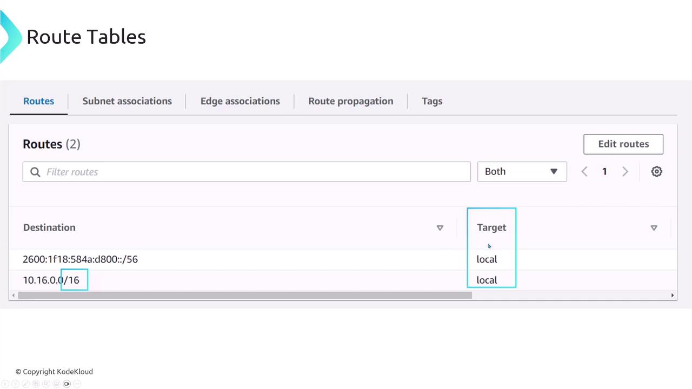
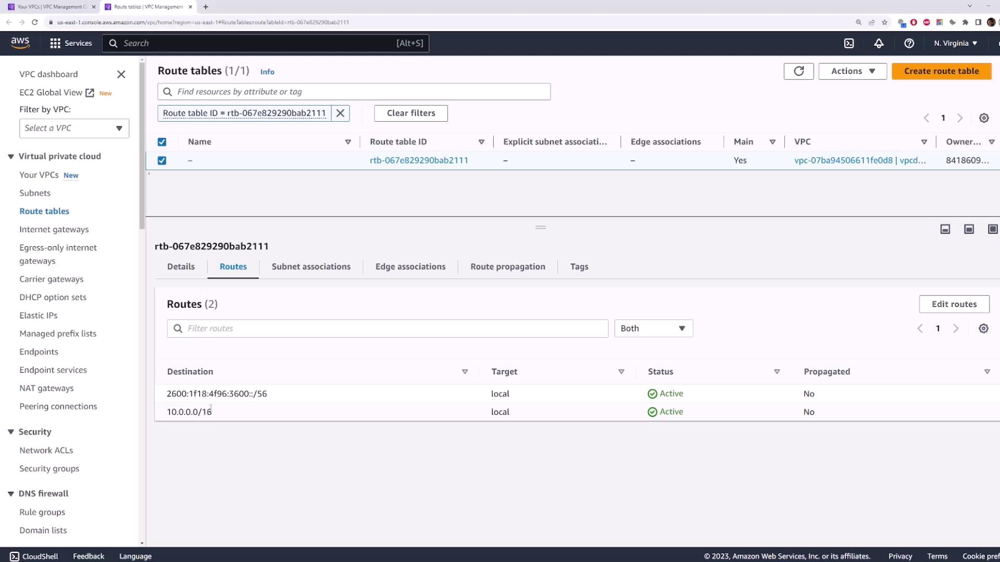
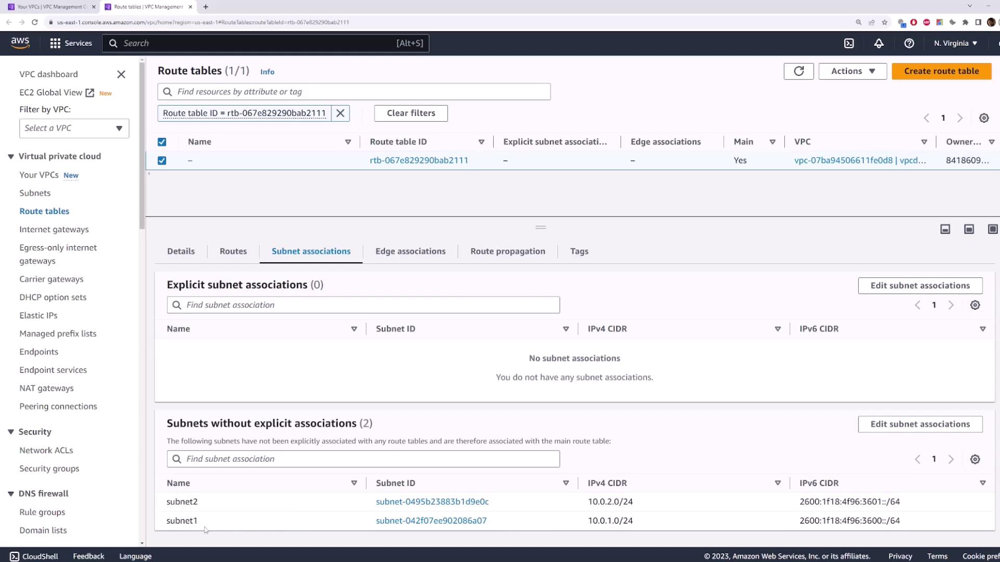
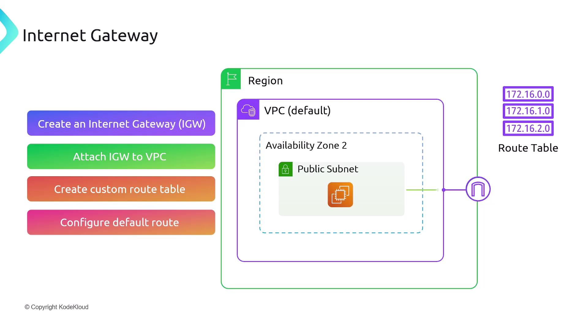
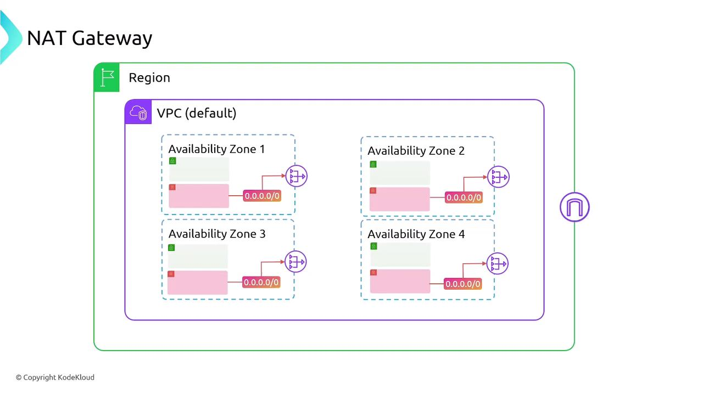
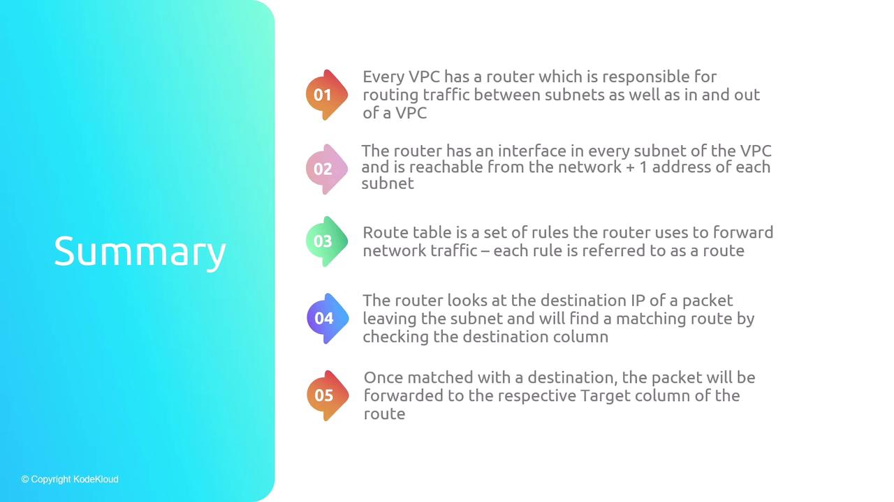
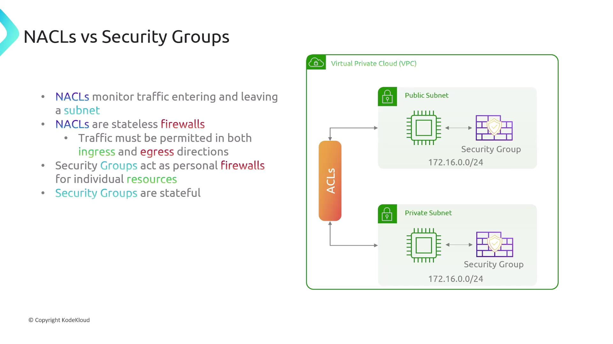

# 02 — Routing, gateways, and SG vs NACL

**Learning objectives**

- Read a **route table**
- Tell apart a **security group** and a **network ACL**

---

## One-sentence idea

**Route tables** decide where traffic goes; **security groups** and **NACLs** decide what traffic is allowed.

---

## Route tables = signposts

Each subnet is associated with one route table. A route says "to reach X, send it to Y".

| Destination | Target | Meaning |
| ----------- | ------ | ------- |
| `10.0.0.0/16` | `local` | Traffic inside the VPC stays local |
| `0.0.0.0/0` | `igw-xxxx` | Everything else → the internet (public subnet) |
| `0.0.0.0/0` | `nat-xxxx` | Everything else → NAT, then internet (private subnet) |

The **only** thing that makes a subnet "public" is a route to an **Internet Gateway**. That's it.

In the **default VPC**, the **main route table** already includes `0.0.0.0/0` → Internet Gateway, and default subnets auto-assign public IPv4 addresses — that is why Lab 04 works without creating `class-vpc` first. Your **custom** VPC from Lab 04A uses the same ideas with different CIDRs (`10.0.0.0/16`) and explicit public vs private subnets.













---

## Security group vs network ACL

Both are firewalls, but at different layers:

| | Security group | Network ACL (NACL) |
| - | -------------- | ------------------ |
| Attached to | An instance (ENI) | A whole subnet |
| Rules | **Allow** only | **Allow and Deny** |
| State | **Stateful** (reply auto-allowed) | **Stateless** (must allow both directions) |
| Typical use | Day-to-day control | Coarse subnet-wide blocks |

> Beginners: do almost everything with **security groups**. Leave the default NACL (allow all) alone until you need subnet-wide deny rules.

---

## Picture it

```text
            ┌──────────── NACL (subnet firewall) ────────────┐
            │   ┌──── Security group (instance firewall) ──┐ │
 Internet ─▶│   │            EC2 instance                  │ │
            │   └──────────────────────────────────────────┘ │
            └────────────────────────────────────────────────┘
```

Traffic must pass the **NACL** (subnet) *and* the **security group** (instance) to reach the app.



---

## Knowledge check

1. What single thing makes a subnet "public"?
2. A security group is stateful. What does that mean?

<details>
<summary>Answers</summary>

1. A route to an Internet Gateway in its route table.
2. If you allow inbound traffic, the response is automatically allowed back out — you don't need a matching outbound rule.

</details>

➡️ Next: [Lab 04B](./Lab-04B-Public-Private-Test.md)
