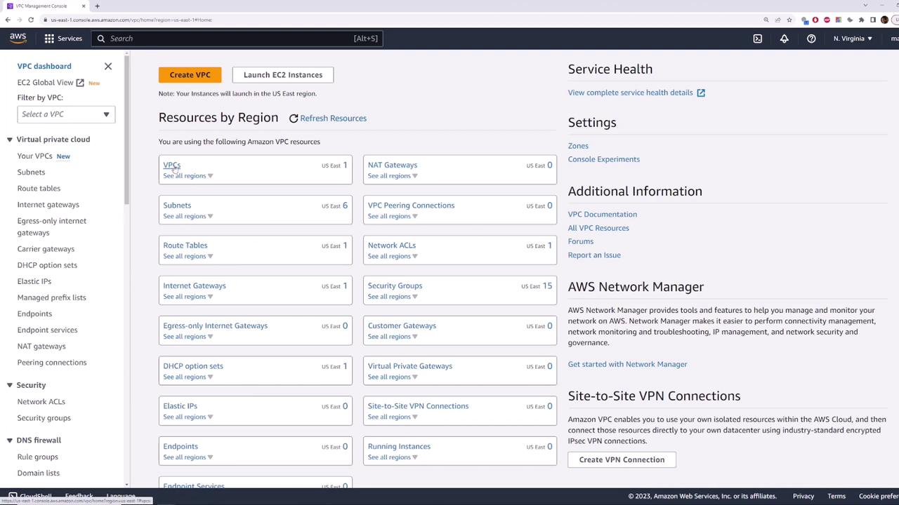
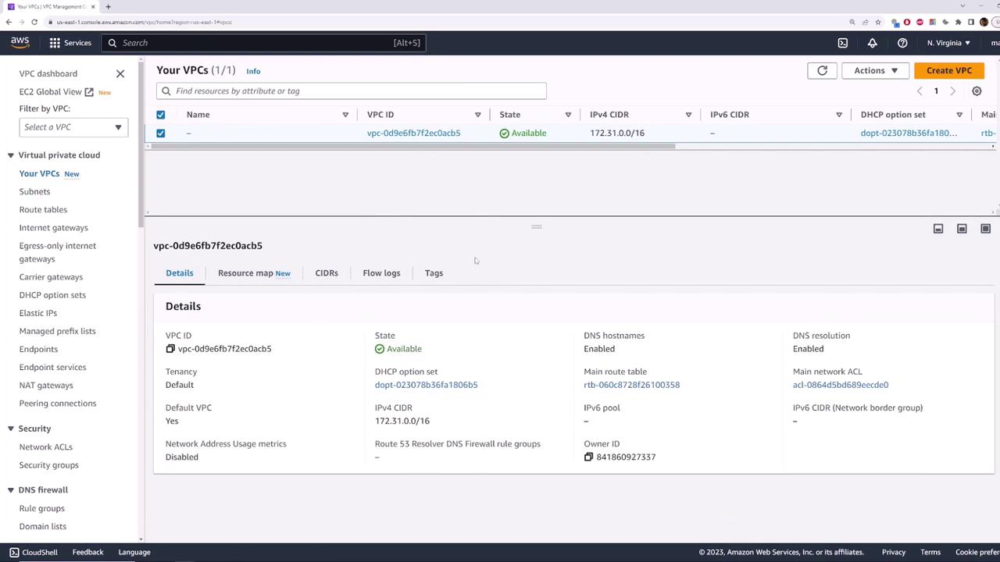
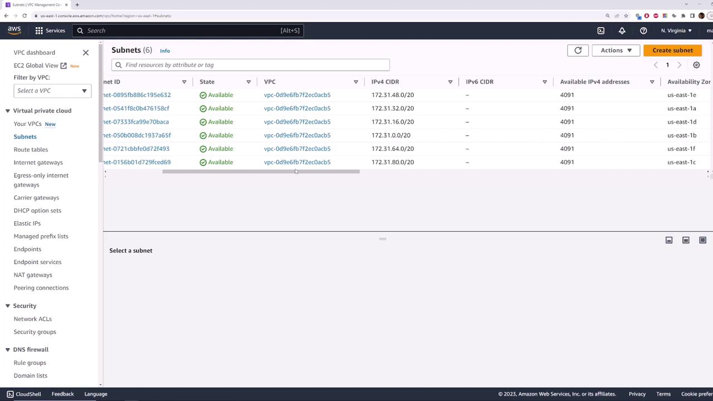
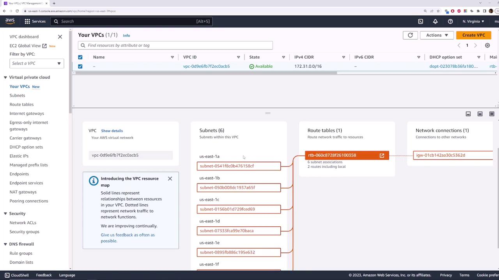

# 03 — Default VPC demo (console walkthrough)

**Learning objectives**

- Find and inspect the **default VPC** in the AWS console
- See how **one subnet per AZ** maps to CIDR blocks in `us-east-1`
- Explain why an EC2 instance in a default subnet gets a **public IP** and internet access without extra setup

> Console screenshots in this lesson are stored under [`../images/day-04-vpc/`](../images/day-04-vpc/) (from [KodeKloud AWS Networking Fundamentals](https://kodekloud.com/courses/aws-networking-fundamentals)).

---

## Why start here?

Before you build `class-vpc` in Lab 04A, AWS already created a **default VPC** in every region. Launching your first EC2 instance (Day 3) often used this network without you noticing. Understanding the default VPC makes custom VPCs easier.

---

## Inspecting the default VPC

1. Sign in to the **AWS Management Console**.
2. Open **VPC** (search “VPC” or pick it from recently visited services).
3. In the sidebar, click **VPCs** and find the row where **Default VPC** is **Yes**.

You should see:

| Field | Typical value |
| ----- | ------------- |
| **State** | `available` |
| **IPv4 CIDR** | `172.31.0.0/16` |
| **Default VPC** | Yes |

> **Tip:** Every AWS region gets **one** default VPC. The CIDR is usually the same (`172.31.0.0/16`), but it is a **separate** VPC per region — not one VPC stretched globally.

---

## Default VPC across regions

1. Change region (for example **US East (N. Virginia)** → **US East (Ohio)**).
2. Open **VPCs** again — you still see a single default VPC with the same CIDR pattern.

This is why you always check **which region** you are in before launching instances or building custom networks.

---

## Subnets by Availability Zone

In the default VPC, AWS creates **one subnet per Availability Zone** in that region. In **us-east-1** there are six AZs, so you get six subnets:

| Availability Zone | Subnet IPv4 CIDR |
| ----------------- | ---------------- |
| us-east-1a | `172.31.0.0/20` |
| us-east-1b | `172.31.16.0/20` |
| us-east-1c | `172.31.32.0/20` |
| us-east-1d | `172.31.48.0/20` |
| us-east-1e | `172.31.64.0/20` |
| us-east-1f | `172.31.80.0/20` |

Each `/20` is a slice of the parent `/16` VPC range — same idea as the `10.0.1.0/24` subnets you will create in Lab 04A, different numbers.

---

## Resource map visualization

Open the VPC **Resource map** to see how subnets, route tables, and the internet gateway connect.

Use this view when a subnet “should” have internet but does not — trace the path visually before editing route tables.

---

## Internet gateway and default route

For the default VPC, AWS already attached:

- A **default Internet Gateway** to the VPC
- A **main route table** with `0.0.0.0/0` → that Internet Gateway
- **Auto-assign public IPv4** enabled on default subnets

So an EC2 instance launched into a default subnet usually receives a **public IP** and can reach the internet (if the security group allows outbound traffic and you allow SSH or HTTP as needed).

This is the same **public subnet** idea from [01 — What is a VPC?](./01-What-is-a-VPC.md): a route to an IGW plus a public IP on the instance.

---

## Hands-on next step

Launch a test instance and prove connectivity: [Lab 04 — Default VPC EC2](./Lab-04-Default-VPC-Demo.md).

Then you will build your own `class-vpc` where **you** choose CIDRs, public vs private subnets, and NAT.

---

## Knowledge check

1. What is the usual CIDR of a default VPC?
2. How many default subnets does `us-east-1` have, and why?
3. What three things (together) give a default-subnet instance internet access?

Answers

1. `172.31.0.0/16` (per region’s default VPC).
2. Six — one per AZ in that region.
3. Internet Gateway attached, route `0.0.0.0/0` to the IGW, public IP on the instance (plus security group rules for the traffic you need).

---

## Links and references

- [Amazon VPC User Guide](https://docs.aws.amazon.com/vpc/latest/userguide/)
- [Launch an EC2 instance](https://docs.aws.amazon.com/AWSEC2/latest/UserGuide/EC2_GetStarted.html)
- [Regions and Availability Zones](https://docs.aws.amazon.com/AWSEC2/latest/UserGuide/using-regions-availability-zones.html)

➡️ Next: [Lab 04 — Default VPC EC2](./Lab-04-Default-VPC-Demo.md)
