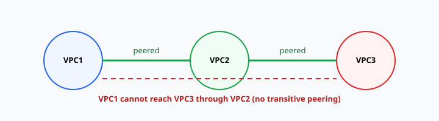

# 04 — VPC peering

**Learning objectives**

- Explain **VPC peering** and when to use it
- List requirements: **non-overlapping CIDRs**, routes on **both** sides, **security groups**
- Know that peering is **not transitive**

> Peering walkthrough: [Lab 04C — VPC peering (step-by-step)](./Lab-04C-VPC-Peering.md)

---

## One-sentence idea

**VPC peering** is a private wire between two VPCs so instances can talk using **private IPs** — without sending traffic over the public internet.

---

## When you need it

| Situation | Peering helps? |
| --------- | -------------- |
| App in VPC-A must call a database in VPC-B | Yes |
| Two teams own separate VPCs in the same org | Yes |
| You need VPC-A → VPC-B → VPC-C in one hop | **No** (not transitive) |
| Full mesh of 20 VPCs | Consider **Transit Gateway** (later course) |

By default, **VPCs do not talk to each other**. Peering (or Transit Gateway, VPN, etc.) is how you connect them.

---

## Architecture

| Piece | Role |
| ----- | ---- |
| **Peering connection** (`pcx-…`) | Logical link between two VPCs |
| **Route in VPC-A** | `10.2.0.0/16` → `pcx-…` |
| **Route in VPC-B** | `10.1.0.0/16` → `pcx-…` |
| **Security groups** | Must allow traffic from the **other VPC CIDR** |

Peering alone does **nothing** until **both** route tables are updated. Status `active` only means the link exists.

---

## Rules that fail exams and labs

1. **Overlapping CIDRs** — you cannot peer `10.0.0.0/16` with `10.0.0.0/16`.
2. **Symmetric routes** — each side needs a route to the **remote** CIDR.
3. **Not transitive** — if VPC1↔VPC2 and VPC2↔VPC3, VPC1 does **not** reach VPC3 via VPC2.

4. **Same account vs cross-account** — cross-account requires the **accepter** to approve the request.
5. **DNS** — optional setting if you need to resolve private hostnames across VPCs (advanced; not required in Lab 04C).

---

## Peering vs Internet Gateway

| | Internet Gateway | VPC peering |
| - | ---------------- | ----------- |
| Traffic | Public internet path | AWS private network |
| Typical use | Users hit your web server | Service-to-service inside AWS |
| Billing | Data transfer + public path | Peering connection free; **data transfer** charges may apply |

---

## Knowledge check

1. What must be true about the two VPC CIDR blocks?
2. Peering shows **Active** but ping fails — name two things to check.
3. Can VPC-A reach VPC-C if only A↔B and B↔C are peered?

Answers

1. They must **not overlap**.
2. **Routes** on both sides to the remote CIDR via `pcx-…`; **security groups** (and NACLs) allowing ICMP or the app port from the other CIDR.
3. No — peering is not transitive.

➡️ Next: [Lab 04C — VPC peering](./Lab-04C-VPC-Peering.md) · then [05 — Elastic Load Balancing](./05-Elastic-Load-Balancing.md)
