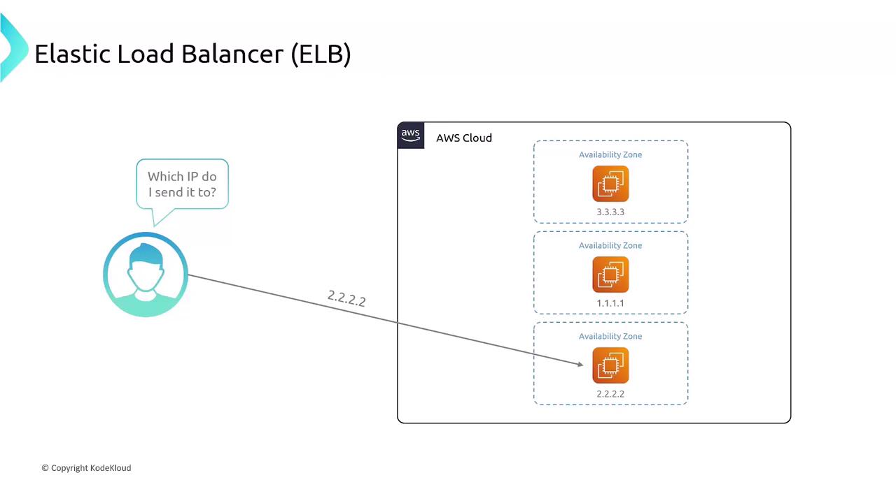
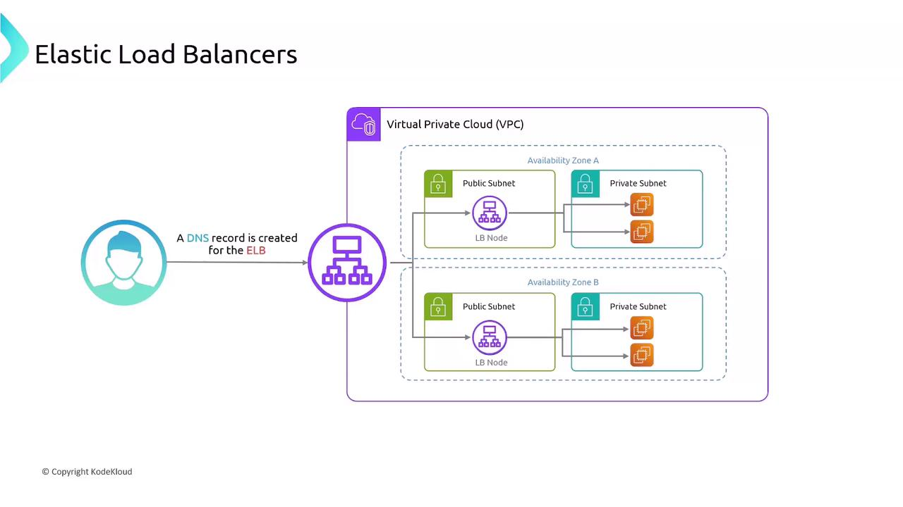
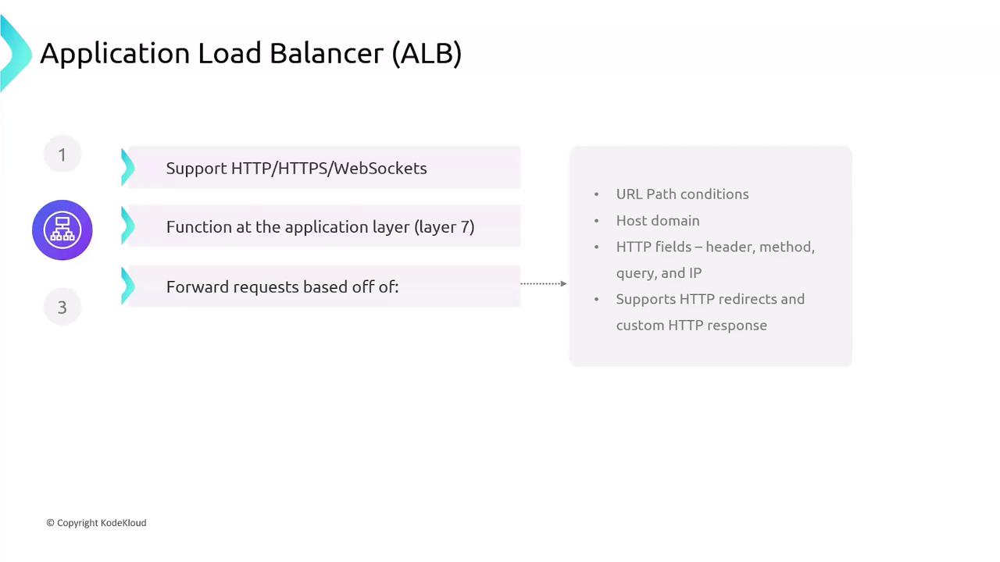
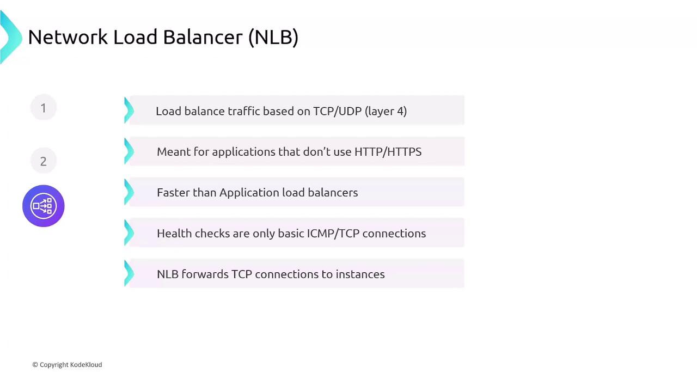
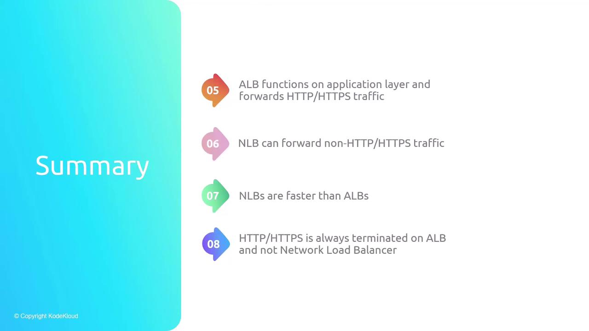

# 05 — Elastic Load Balancing (ELB)

**Learning objectives**

- Name load balancer types: **ALB**, **NLB**, and **Classic** (legacy, awareness)
- Describe **target group**, **listener**, and **health check**
- Place an **Application Load Balancer** in front of multiple EC2 instances

> Hands-on: [Lab 04D — Application Load Balancer (step-by-step)](./Lab-04D-Application-Load-Balancer.md)

---

## One-sentence idea

A **load balancer** is a front door that spreads user traffic across **multiple servers** so one slow or broken server does not take down the whole app.

---

## Why load balance?

```text
Without LB:  Users ──▶ one EC2  (single point of failure)

With ALB:    Users ──▶ ALB ──┬──▶ EC2 #1
                              ├──▶ EC2 #2
                              └──▶ EC2 #3
```

- **High availability** — unhealthy targets are skipped.
- **Scale** — add instances to the target group.
- **Single DNS name** — clients use the ALB hostname, not individual instance IPs.





---

## ALB vs NLB (class focus)

| | **Application Load Balancer (ALB)** | **Network Load Balancer (NLB)** |
| - | ----------------------------------- | ------------------------------- |
| Layer | **HTTP/HTTPS** (Layer 7) | **TCP/UDP** (Layer 4) |
| Use case | Web APIs, microservices, path-based routing | Extreme performance, static IP, non-HTTP |
| This course | **Yes — Lab 04D** | Know the name only |







---

## Pieces you will click in the console

| Term | Meaning |
| ---- | ------- |
| **Load balancer** | The AWS resource with a DNS name |
| **Listener** | “On port 80, send traffic to target group X” |
| **Target group** | Pool of EC2 instances (or IPs, Lambda, etc.) |
| **Health check** | ALB probes `/` or a path; failed checks remove a target |
| **Security group** | ALB SG allows **inbound 80/443 from users**; instance SG allows **inbound 80 from ALB SG** |

ALB nodes live in **subnets you choose** (usually **public** subnets for internet-facing apps).

---

## Request path (mental model)

```text
Browser → ALB DNS (public) → listener :80 → target group → EC2 :80 (nginx)
```

Instance security groups should allow HTTP **from the load balancer**, not only from “My IP”.

---

## Knowledge check

1. Which load balancer type should terminate HTTPS and route `/api` vs `/` to different targets?
2. What happens if all targets fail the health check?
3. Why put the ALB in public subnets for a public website?

<details>
<summary>Answers</summary>

1. **ALB** (Layer 7 path-based routing).
2. ALB returns **503** — no healthy targets.
3. Internet clients must reach the ALB; instances can stay private if only the ALB talks to them (common pattern).

</details>

➡️ Next: [Lab 04D — Application Load Balancer](./Lab-04D-Application-Load-Balancer.md)
