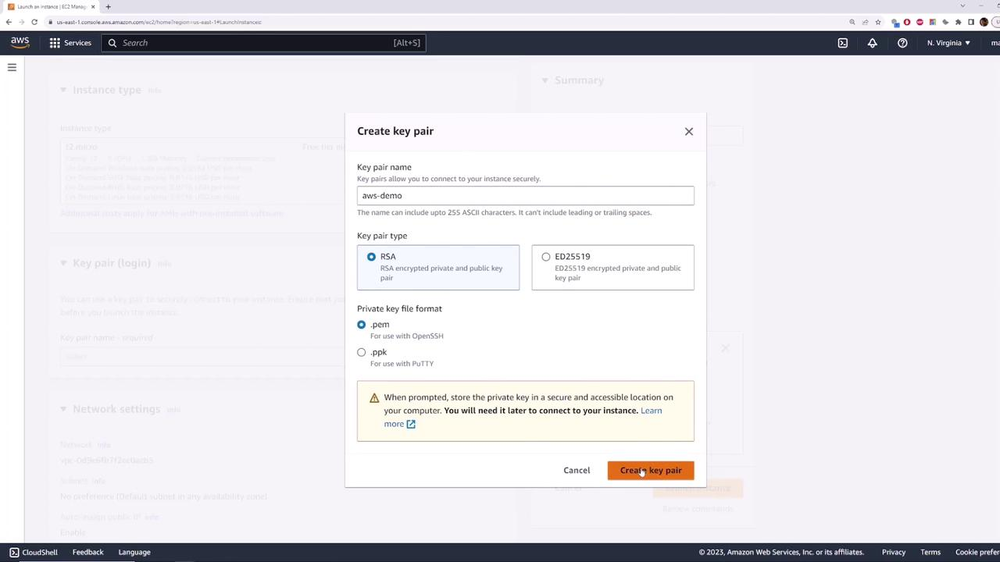
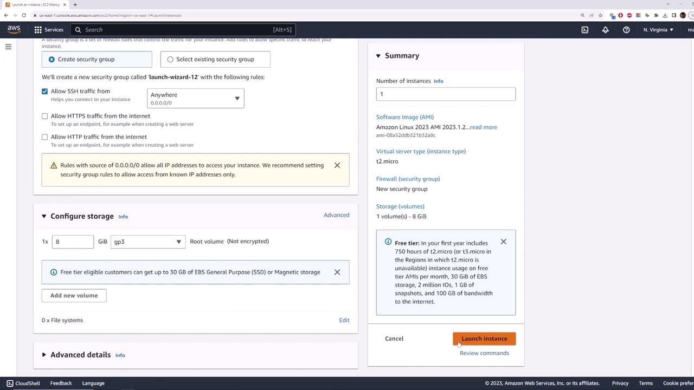

# Lab 04 — Default VPC EC2 (internet test)

**Time:** 20 minutes  
**Goal:** Launch Linux in the **default VPC**, SSH in, and confirm internet connectivity — no custom VPC wizard required.

> Follows the console flow from [03 — Default VPC demo](./03-Default-VPC-Demo.md). Terminate the instance when finished to avoid charges.

---

## Part A — Launch instance (12 min)

1. Open **EC2** → **Launch instance**.
2. **Name:** `default-vpc-demo`
3. **AMI:** Amazon Linux 2 or **Amazon Linux 2023** (Free Tier–eligible).
4. **Instance type:** `t2.micro` or `t3.micro`.
5. **Key pair:** Create new, name `aws-demo` (or reuse `class-key` from Day 3). Download the `.pem` file.



6. **Network settings** → **Edit**:
   - **VPC:** default VPC (`172.31.0.0/16`)
   - **Subnet:** any default subnet (for example `us-east-1b`)
   - **Auto-assign public IP:** **Enable**
7. **Security group:** allow **SSH (22)** from **My IP**.
8. **Launch instance**.



Wait until **Instance state** is **Running**. Copy the **Public IPv4 address**.

---

## Part B — SSH and ping (8 min)

From your laptop (WSL, macOS, or Linux):

```bash
chmod 400 aws-demo.pem    # or class-key.pem
ssh -i aws-demo.pem ec2-user@<PUBLIC_IP>
```

Amazon Linux 2023 may use `ec2-user`; Ubuntu AMIs use `ubuntu`.

Test outbound connectivity:

```bash
ping -c 4 8.8.8.8
```

Example:

```text
64 bytes from 8.8.8.8: icmp_seq=1 ttl=110 time=0.965 ms
--- 8.8.8.8 ping statistics ---
4 packets transmitted, 4 received, 0% packet loss
```

Optional:

```bash
curl -sI https://aws.amazon.com | head -n 1
```

✅ **Checkpoint:** Ping or `curl` succeeds — default VPC + public IP + IGW route is working.

---

## Part C — Tie back to the VPC console (optional, 5 min)

1. **VPC → Your VPCs** — confirm the instance’s VPC is the **default** one.
2. **VPC → Route tables** — find the main table with `0.0.0.0/0` → `igw-...`.
3. Say in one sentence: *what would be different if you launched into a **private** subnet with no public IP?*

---

## Cleanup

1. **EC2 → Instances** → select `default-vpc-demo` → **Instance state → Terminate**.

> **Warning:** Leaving instances running accrues cost. Default VPC itself has no hourly charge; EC2 does.

---

## If you get stuck

| Problem | Fix |
| ------- | --- |
| SSH timeout | Wrong IP, security group not allowing **your** current IP, or instance not **running** |
| `Permission denied (publickey)` | Wrong `.pem`, wrong user (`ec2-user` vs `ubuntu`), or key not chmod `400` |
| No public IP | Subnet or launch setting — enable **Auto-assign public IP** |
| Ping fails but `curl` works | Some networks block ICMP; try `curl` instead |

---

## Deliverables

- [ ] Instance launched in **default VPC** with public IP
- [ ] Successful SSH session
- [ ] Proof of internet (`ping` or `curl`)
- [ ] Instance **terminated**

➡️ Next: [Lab 04A — Build a VPC with the wizard](./Lab-04A-Build-a-VPC.md)
