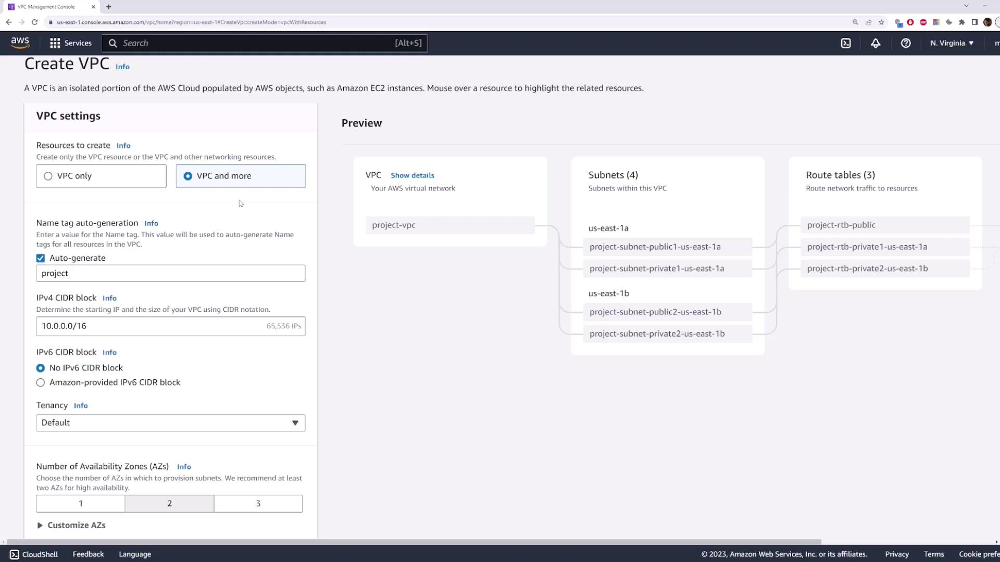
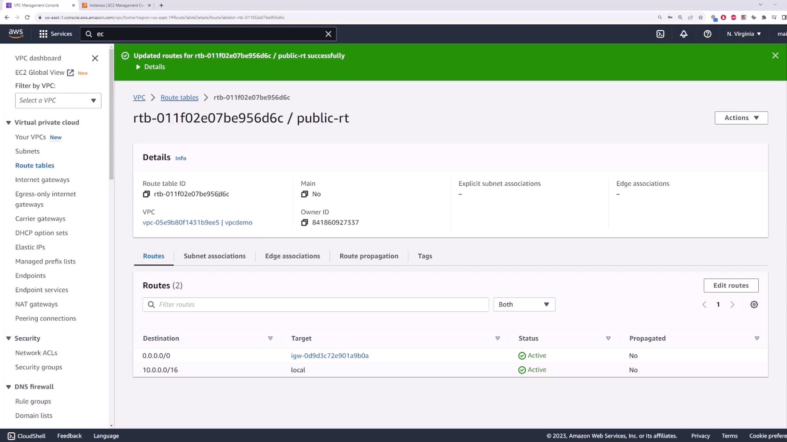
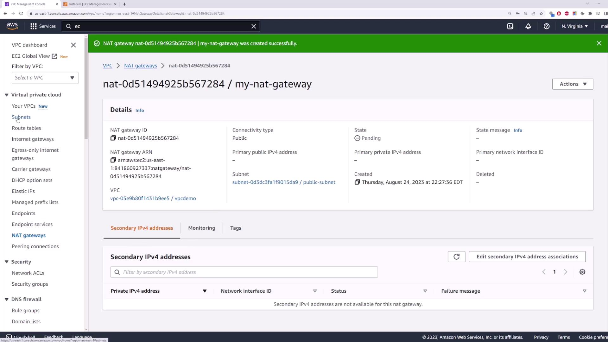

# Lab 04A — Build a VPC with the wizard

**Time:** 15 minutes
The wizard creates subnets, route tables, and gateways for you. We'll inspect each piece after.

---

## Part A — Create the VPC (8 min)

1. **VPC → Create VPC**.
2. Choose **VPC and more** (the wizard).



3. Settings:
   - **Name tag:** `class-vpc`
   - **IPv4 CIDR:** `10.0.0.0/16`
   - **Availability Zones:** `2`
   - **Public subnets:** `2`
   - **Private subnets:** `2`
   - **NAT gateways:** **In 1 AZ** (cheaper for class)
   - **VPC endpoints:** **None**
4. **Create VPC.** Watch it build the pieces.

---

## Part B — Inspect what it made (7 min)

Open each and note what you see:

1. **Subnets** — 2 public + 2 private, each in a different AZ.
2. **Route tables:**
   - Public RT has a route `0.0.0.0/0 → igw-...` (Internet Gateway).
   - Private RT has a route `0.0.0.0/0 → nat-...` (NAT Gateway).
3. **Internet gateways** — one attached to `class-vpc`.
4. **NAT gateways** — one in a public subnet (this is the one that **costs money**).





```text
class-vpc 10.0.0.0/16
 ├─ public-subnet-1  → IGW → internet
 ├─ public-subnet-2  → IGW → internet
 ├─ private-subnet-1 → NAT → internet (outbound only)
 └─ private-subnet-2 → NAT → internet (outbound only)
```

---

## If you get stuck

| Problem | Fix |
| ------- | --- |
| Can't find "VPC and more" | You're on the plain Create VPC form — pick the wizard option at the top. |
| NAT gateway "pending" | It takes a couple of minutes to become **Available**. |

> Don't delete anything yet — Lab 04B uses this VPC. Delete at end of day.

---

## Deliverables

- [ ] `class-vpc` with 2 public + 2 private subnets
- [ ] Verified the public and private route tables
- [ ] Found the NAT Gateway (the costly piece)

➡️ Next: [02 — Routing, gateways, SG vs NACL](./02-Routing-and-Security.md)
