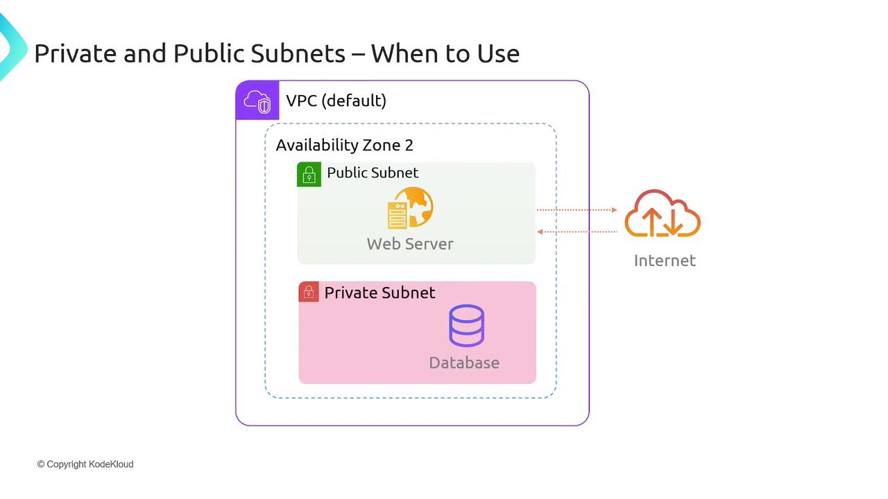

# Lab 04B — Public + private subnet test

**Time:** 15 minutes
Uses `class-vpc` from Lab 04A. We'll prove the public subnet reaches the internet and the private one is hidden.



---

## Part A — A public instance (6 min)

1. **EC2 → Launch instance**, name `public-ec2`, tag `Project=aws-class`.
2. Instance type `t2.micro`.
3. **Network settings → Edit:**
   - VPC: `class-vpc`
   - Subnet: a **public** subnet
   - **Auto-assign public IP: Enable**
   - Security group: allow **SSH (22) from My IP**
4. Launch. It gets a **public IP** → it lives on an internet-facing street.

---

## Part B — A private instance (5 min)

1. Launch another, name `private-ec2`, tag `Project=aws-class`.
2. **Network settings → Edit:**
   - VPC: `class-vpc`
   - Subnet: a **private** subnet
   - **Auto-assign public IP: Disable**
   - Security group: allow **SSH (22) from 10.0.0.0/16** (inside the VPC only)
3. Launch. It has **no public IP** → the internet cannot reach it directly.


---

## Part C — Prove the routing (4 min)

1. SSH into `public-ec2` (it has a public IP).
2. From there, SSH to the **private IP** of `private-ec2` (same key). This works because they share the VPC.
3. On `private-ec2`, run:
   ```bash
   curl -s https://aws.amazon.com | head -n 3
   ```
   It works — outbound internet via the **NAT Gateway** — even though nothing can reach it from outside.

---

## End of day — delete the NAT Gateway 💸

```text
VPC → NAT gateways → select → Delete
EC2 → terminate public-ec2 and private-ec2
```

> The NAT Gateway is the expensive piece. Deleting the VPC later also removes subnets, route tables, and the IGW.

---

## If you get stuck

| Problem | Fix |
| ------- | --- |
| Can't SSH to private instance | Hop through `public-ec2` (bastion); check the SG allows 22 from the VPC CIDR. |
| `curl` hangs on private-ec2 | NAT gateway still "pending" or route table missing the `0.0.0.0/0 → nat` route. |

---

## Deliverables

- [ ] `public-ec2` reachable from the internet
- [ ] `private-ec2` reachable only from inside the VPC, but has outbound via NAT
- [ ] **Deleted the NAT Gateway** and terminated both instances

➡️ Extension (same week): [04 — VPC peering](./04-VPC-Peering.md) · [05 — Load balancing](./05-Elastic-Load-Balancing.md)

➡️ Next day: [Day 5 — Storage (S3 + EBS)](../Day-05-Storage-S3-EBS/)
