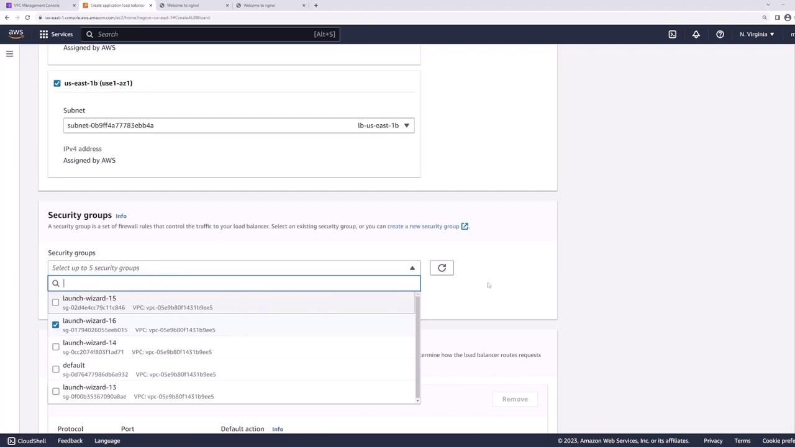
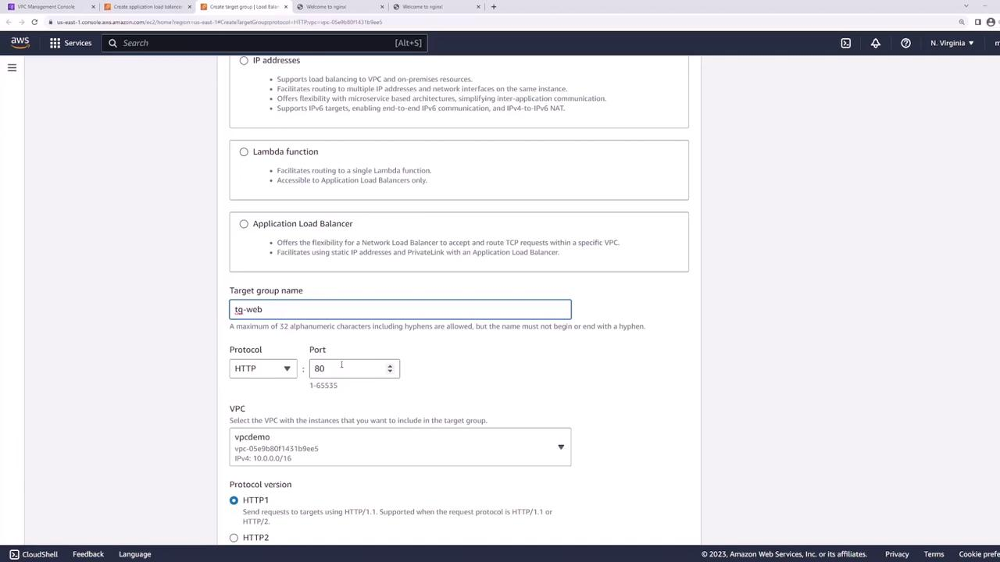
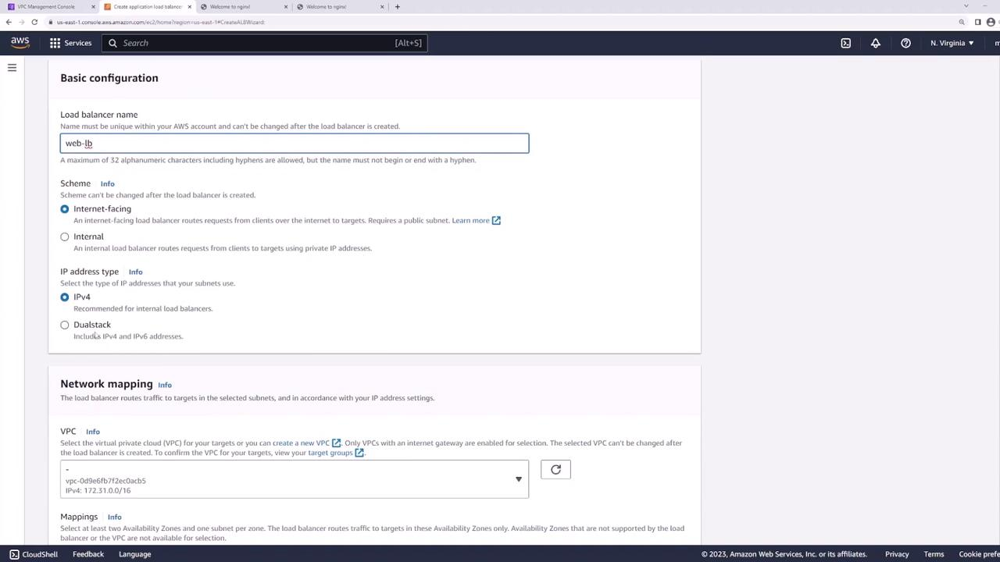
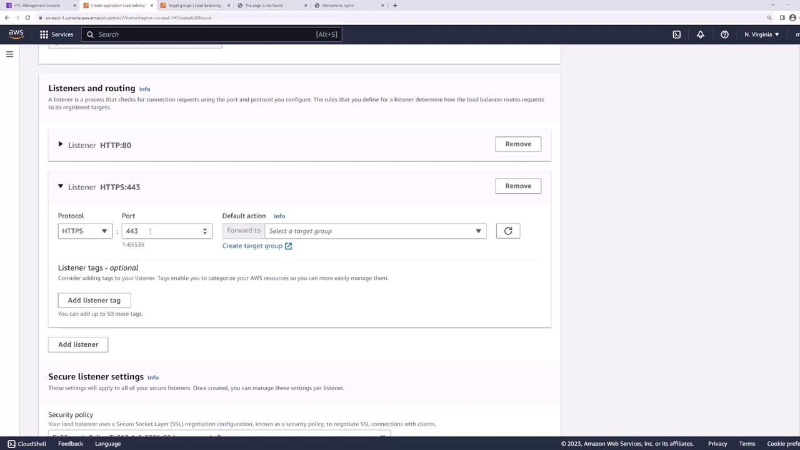

# Lab 04D — Application Load Balancer (step-by-step)

**Time:** 45–60 minutes (extension lab)  
**Goal:** Internet-facing **ALB** distributes HTTP traffic across **two EC2** web servers.

**Prerequisites:** `class-vpc` from [Lab 04A](./Lab-04A-Build-a-VPC.md) **or** default VPC with two instances in the same VPC.

> **Cost:** ALB has an hourly charge (~$0.0225/hr + LCU). **Delete the load balancer** when finished.

---

## Part 1 — Plan (2 min)

| Piece | Your choice |
| ----- | ----------- |
| VPC | `class-vpc` (recommended) |
| Instances | `web-alb-1-<initials>`, `web-alb-2-<initials>` |
| Subnets | Two **public** subnets (different AZs if possible) |
| Port | HTTP **80** |


---

## Part 2 — Security groups (10 min)

You need **two** security groups.

### Step 2.1 — ALB security group

1. **EC2 → Security Groups → Create**.
2. Name: `sg-alb-<initials>`, VPC = `class-vpc`.
3. **Inbound:**

| Type | Port | Source |
| ---- | ---- | ------ |
| HTTP | 80 | `0.0.0.0/0` (lab only) |

4. Outbound: leave default (all traffic).
5. Create.



### Step 2.2 — Web server security group

1. Create `sg-web-<initials>` in `class-vpc`.
2. **Inbound:**

| Type | Port | Source |
| ---- | ---- | ------ |
| HTTP | 80 | **Security group** → `sg-alb-<initials>` |
| SSH | 22 | **My IP** (optional, for debugging) |

3. Create.

> Instances accept HTTP **only from the ALB**, not from the whole internet.

---

## Part 3 — Launch two web servers (12 min)

### Step 3.1 — User data for server 1

**EC2 → Launch instance** → expand **Advanced details** → **User data**:

```bash
#!/bin/bash
dnf install -y nginx
echo "<h1>Server 1 - $(hostname)</h1>" > /usr/share/nginx/html/index.html
systemctl enable --now nginx
```

| Setting | Value |
| ------- | ----- |
| Name | `web-alb-1-<initials>` |
| VPC / subnet | `class-vpc` · **public subnet 1** |
| Public IP | Enable |
| SG | `sg-web-<initials>` |

Launch.

### Step 3.2 — User data for server 2

Same as above but:

- Name: `web-alb-2-<initials>`
- **User data** heading: `Server 2`
- **Public subnet 2** (second AZ if available)

### Step 3.3 — Wait and quick test (optional)

1. Wait **Status check = 2/2 passed**.
2. Open `http://<WEB1_PUBLIC_IP>` in a browser — you should see **Server 1**.

✅ **Checkpoint 1:** Both instances serve different pages on port 80 (test by public IP once).

---

## Part 4 — Target group (8 min)

### Step 4.1 — Create target group

1. **EC2 → Target Groups → Create target group**.
2. **Target type:** Instances.
3. **Name:** `tg-web-<initials>`.
4. **Protocol / Port:** HTTP **80**.
5. **VPC:** `class-vpc`.
6. **Health check path:** `/` (default).
7. **Next** → Register targets:
   - Select **web-alb-1** and **web-alb-2**.
   - Click **Include as pending below**.
8. **Create target group**.

### Step 4.2 — Wait for healthy

1. Open the target group → **Targets** tab.
2. Wait until **Health status** = **healthy** (1–3 minutes).

If **unhealthy**: check `sg-web` allows HTTP from `sg-alb`; nginx running (`sudo systemctl status nginx`).



✅ **Checkpoint 2:** **Two healthy targets**.

---

## Part 5 — Create the Application Load Balancer (10 min)

### Step 5.1 — Create ALB

1. **EC2 → Load Balancers → Create load balancer**.
2. Choose **Application Load Balancer** → **Create**.
3. **Name:** `alb-web-<initials>`.
4. **Scheme:** **Internet-facing**.
5. **IP address type:** IPv4.
6. **Network mapping:** `class-vpc` — select **at least two public subnets** (two AZs).
7. **Security groups:** `sg-alb-<initials>`.
8. **Listeners:** HTTP **80** → forward to `tg-web-<initials>`.
9. Create (review defaults; no HTTPS needed for lab).



### Step 5.2 — Copy DNS name

1. Open the new load balancer.
2. Copy **DNS name** (e.g. `alb-web-1234567890.eu-west-1.elb.amazonaws.com`).



✅ **Checkpoint 3:** ALB state **active**; DNS name copied.

---

## Part 6 — Test load balancing (5 min)

### Step 6.1 — Browser test

1. Open `http://<ALB_DNS_NAME>/` (no HTTPS).
2. Refresh **10+ times** — you should sometimes see **Server 1** and sometimes **Server 2**.

### Step 6.2 — curl test (optional)

```bash
for i in 1 2 3 4 5; do curl -s http://<ALB_DNS_NAME>/ | head -1; done
```

✅ **Checkpoint 4:** Responses alternate (or change) between servers.

---

## Part 7 — Cleanup (8 min)

1. **EC2 → Load Balancers** → select ALB → **Delete**.
2. **Target Groups** → delete `tg-web-<initials>` (after ALB is gone).
3. **Terminate** `web-alb-1` and `web-alb-2`.
4. Delete security groups `sg-alb` and `sg-web` if unused.
5. If this was the last use of `class-vpc` today, also delete **NAT Gateway** per [Lab 04B](./Lab-04B-Public-Private-Test.md).

---

## If you get stuck

| Symptom | Fix |
| ------- | --- |
| 503 from ALB | No healthy targets — fix SG or nginx |
| Targets unhealthy | Instance SG must allow **80 from ALB SG** |
| ALB not reachable | ALB SG must allow **80 from 0.0.0.0/0**; use **public** subnets |
| Same server every refresh | Normal with few requests; try more refreshes or two browser profiles |
| Cannot create ALB | Need **two subnets in two AZs** in the VPC |

---

## Deliverables

- [ ] Screenshot: target group with **2 healthy** targets
- [ ] Screenshot: browser showing page via **ALB DNS** (not instance IP)
- [ ] ALB and test instances **deleted**

➡️ Next day: [Day 5 — Storage (S3 + EBS)](../Day-05-Storage-S3-EBS/)
