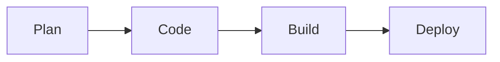

# 13 - Wiki

## Overview

The **Wiki** is a built-in documentation space for your project. It uses **Markdown**, is version-controlled in Git, and is the natural place for onboarding guides, architecture docs, runbooks, meeting notes, and decisions.

## Two Kinds of Wikis

| Type | Description |
| ---- | ----------- |
| **Project wiki** | A wiki provisioned by Azure DevOps, stored in a hidden Git repo. Edit in the browser. |
| **Code wiki (publish-as-wiki)** | Publish Markdown files from an existing repo folder as a wiki. Docs live next to the code. |

A **code wiki** is great for keeping documentation in the same PR as the code change.

## Creating a Wiki

1. **Overview → Wiki**.
2. For a project wiki: click **Create project wiki**.
3. For a code wiki: **Publish code as wiki** → choose repo, folder, and branch.

## Writing Pages (Markdown)

Wikis support standard Markdown plus extras:

```markdown
# Page Title

## Section

- Bullet list
- **Bold**, *italic*, `code`

[Link to another page](./Other-Page)

| Col A | Col B |
| ----- | ----- |
| 1     | 2     |
```

Extras supported:
- **Mermaid diagrams** for flowcharts/sequence diagrams.
- **Math** (KaTeX/LaTeX).
- **TOC** tag `[[_TOC_]]` to auto-generate a table of contents.
- **Work item mentions** with `#123` and **@mentions** for people.
- **Code snippets** with syntax highlighting.

### Mermaid example
~~~markdown

~~~

## Organizing Pages

- Pages form a **tree** in the left pane.
- **Drag** to reorder or nest pages (creates parent/child).
- Use clear, hierarchical structure (e.g., Onboarding, Architecture, Runbooks).

## Versioning & History

- Every edit is a Git commit — full **history** and **revert** are available.
- For code wikis, docs are versioned with your code branches.

## Collaboration Features

- **Comments** on pages (project wiki).
- **Follow** a page to get notified of changes.
- Link wiki pages from **dashboards** (Markdown widget) and work items.

## Permissions

- Wiki access follows **repository permissions** (it's backed by a Git repo).
- Control who can edit via the underlying repo's security.

## Common Uses

- Project onboarding and setup guides.
- Architecture and design decisions (ADRs).
- Operational **runbooks** and troubleshooting.
- Coding standards and contribution guidelines.
- Meeting notes and retrospectives.

## Best Practices

- Keep a clear **page hierarchy** and a landing/home page.
- Prefer **code wikis** for docs that should change with the code.
- Use **`[[_TOC_]]`** and headings for navigability.
- Link wiki ↔ work items for traceability.
- Review/update docs as part of your Definition of Done.

## Summary

- The Wiki is Markdown-based, Git-backed project documentation.
- Choose a **project wiki** (browser-edited) or **code wiki** (docs beside code).
- Supports Mermaid, math, TOC, work-item/people mentions, and full history.
- Permissions follow the backing repo.

## Knowledge Check

1. What's the difference between a project wiki and a code wiki?
2. How do you auto-generate a table of contents on a wiki page?
3. Why might a team prefer a code wiki?

➡️ Next: [14 - Notifications](./14-Notifications.md)
