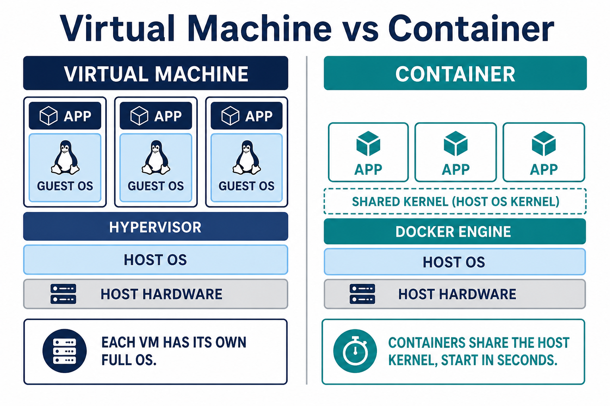

# 01 — Why Docker

**Learning objectives**

- Explain the “it works on my machine” problem
- Contrast a **VM** and a **container**
- Name what Docker gives you: pack once, run anywhere

---

## The problem in class

You install Python 3.11. A teammate has 3.9. The app works on a laptop and fails on the server.

Without containers, every machine needs the same OS packages, versions, and config. That does not scale.

---

## A useful analogy

Phone apps install from a store with their own files. They do not fight each other for “which Java is installed.”

**Containers** bring that idea to servers: frontend, API, and database each run as an isolated process with their own files.

Containers are:

- **Self-contained** — dependencies travel with the app
- **Isolated** — one container crashing should not wipe the host
- **Independent** — delete one without deleting others
- **Portable** — same image on laptop, VM, and cloud

---

## VM vs container

| | Virtual machine | Container |
| - | ---------------- | --------- |
| Isolation | Full guest OS | Process + namespaces |
| Kernel | Own kernel | **Shares host kernel** |
| Size | GBs | Often MBs |
| Start time | Minutes | Seconds |
| Use | Many OS types, strong isolation | Pack apps densely |

You still use VMs in Azure. Docker often **runs inside** a Linux VM.

---

## Inner loop vs outer loop

- **Inner loop:** you write code, build, run, debug — many times a day (`docker build` / `docker run`).
- **Outer loop:** merge, CI tests, deploy, watch production.

This week is mostly the **inner loop**. Day 4–5 start to look like the outer loop (registry, Compose, hygiene).

---

## Knowledge check

1. Why not give every app its own VM?
2. Do containers each have their own kernel?
3. What does portable mean here?

Answers

1. Too much RAM/CPU and slow to start for a single app.
2. No — they share the host kernel.
3. The same image runs the same way on another machine with Docker.

➡️ Next: [02 — Architecture](./02-Architecture.md)
