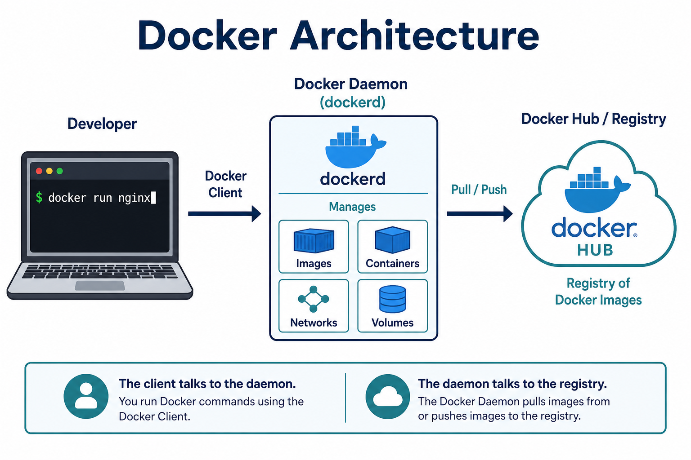

# 02 — Docker Architecture

**Learning objectives**

- Name client, daemon, and registry
- Know which piece actually builds and runs containers

---

---

## Three pieces you will use every day

| Piece | What it is | Example |
| ----- | ---------- | ------- |
| **Client** | The `docker` command you type | `docker run nginx` |
| **Daemon** (`dockerd`) | Engine that creates images, containers, networks, volumes | Docker Desktop includes this |
| **Registry** | Store of images | Docker Hub, Azure Container Registry |

The client talks to the daemon (API). The daemon pulls and pushes images to a registry.

---

## Docker Desktop vs Engine

On Windows/Mac, **Docker Desktop** starts a Linux VM and runs the daemon there. Your `docker` CLI talks to that engine.

On Linux servers you often install **Docker Engine** only (no Desktop UI).

---

## Objects

| Object | Meaning |
| ------ | ------- |
| **Image** | Read-only template (recipe) |
| **Container** | Running (or stopped) instance of an image |
| **Network** | How containers talk |
| **Volume** | Persistent disk data |

---

## Knowledge check

1. Who does the heavy lifting — client or daemon?
2. Where does `docker pull nginx` fetch from by default?
3. Can one image start many containers?

Answers

1. The daemon.
2. Docker Hub (unless you configured another registry).
3. Yes.

➡️ Next: [03 — Install](./03-Install.md)
