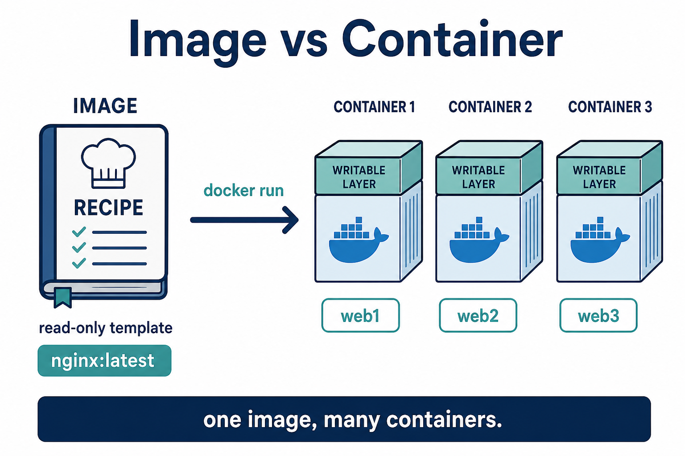
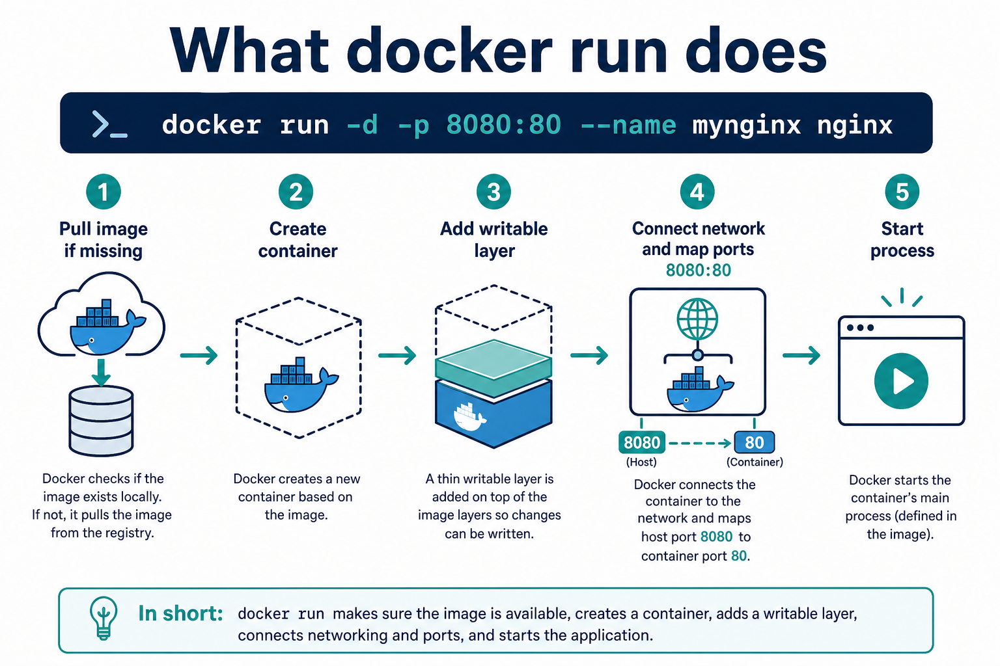

# 04 — Images, containers, and `docker run`

**Learning objectives**

- Tell **image** and **container** apart
- Read what `docker run` does step by step
- Use `-d`, `-p`, `--name`

---

## Image vs container



- **Image** = recipe (read-only). Example: `nginx:latest`
- **Container** = a running (or stopped) copy. Example: `mynginx`

One image → many containers.

---

## What `docker run` does



Example:

```bash
docker pull nginx
docker images
docker run -d -p 8080:80 --name mynginx nginx
```

| Flag | Meaning |
| ---- | ------- |
| `-d` | Detached (background) |
| `-p 8080:80` | Host port **8080** → container port **80** |
| `--name mynginx` | Human name (otherwise a random name) |

Then:

```bash
docker ps
```

Open a browser: **http://localhost:8080** — you should see the nginx welcome page.

On a cloud VM, use `http://<VM-public-IP>:8080` and open the port in the NSG.

---

## Stop, start, remove

```bash
docker stop mynginx
docker ps -a
docker start mynginx
docker stop mynginx
docker rm mynginx
```

`ps` = running. `ps -a` = running **and** stopped.

Interactive example (stops when you press Ctrl+C):

```bash
docker run --rm -it -p 8081:80 --name web2 nginx
```

`--rm` deletes the container when it exits. `-it` attaches your terminal.

---

## Knowledge check

1. Does `docker pull` start an app?
2. Host `8080` maps to which port inside nginx?
3. Why `docker ps -a` after `stop`?

<details>
<summary>Answers</summary>

1. No — it only downloads the image.
2. Container port 80.
3. Stopped containers still exist until `docker rm`.

</details>

➡️ Next: [Lab 01](./Lab-01-First-Containers.md)
