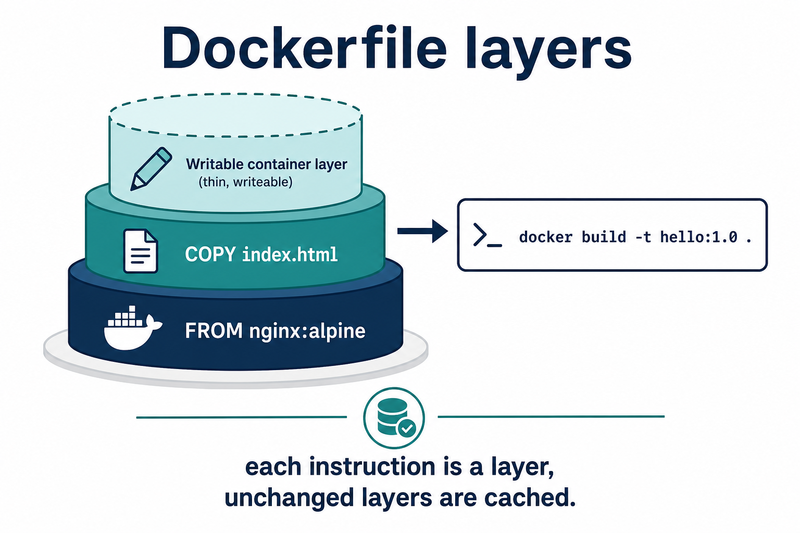

# 02 — Dockerfile

A **Dockerfile** is a text file of instructions. Docker turns it into an image.



---

## Instructions you need this week

| Instruction | Meaning |
| ----------- | ------- |
| `FROM` | Base image (always first) |
| `WORKDIR` | Folder inside the image |
| `COPY` | Copy files from your laptop into the image |
| `RUN` | Command at **build** time (install packages) |
| `EXPOSE` | Documents the port (does not publish it) |
| `CMD` | Default command when the container starts |
| `ENTRYPOINT` | Main process (often with `CMD` as arguments) |

---

## Our sample (nginx + HTML)

File: `sample-app/Dockerfile`

```dockerfile
FROM nginx:alpine
COPY index.html /usr/share/nginx/html/index.html
EXPOSE 80
```

nginx’s image already has a `CMD` to start nginx. We only replace the welcome page.

Build and run (from `sample-app/`):

```bash
docker build -t campus-hello:1.0 .
docker run -d -p 8080:80 --name hello campus-hello:1.0
```

`.` means “this folder is the **build context**” — files Docker may `COPY`.

---

## A slightly richer example (Python)

```dockerfile
FROM python:3.12-alpine
WORKDIR /app
COPY requirements.txt .
RUN pip install --no-cache-dir -r requirements.txt
COPY . .
EXPOSE 5000
CMD ["python", "app.py"]
```

Copy **requirements first**, then the rest of the code. If only `app.py` changes, Docker **reuses** the pip layer.

---

## Knowledge check

1. Does `EXPOSE 80` publish port 80 on your laptop?
2. What does the `.` in `docker build -t x .` mean?
3. `RUN` vs `CMD`?

<details>
<summary>Answers</summary>

1. No — you still need `-p` or Compose `ports:`.
2. Build context (current directory).
3. `RUN` happens at build. `CMD` happens when the container starts.

</details>

➡️ Next: [03 — Build cache](./03-Build-Cache.md)
