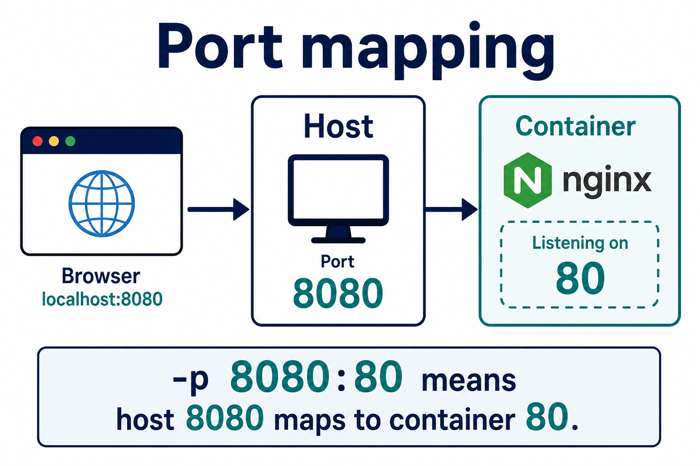

# 02 — Ports



**Learning objectives**

- Read `-p HOST:CONTAINER`
- Know `EXPOSE` does not publish

---

```bash
docker run -d -p 8080:80 --name hello campus-hello:1.0
```

| Side | Port | Who uses it |
| ---- | ---- | ----------- |
| Host (your laptop / VM) | 8080 | Browser: localhost:8080 |
| Container | 80 | nginx inside |

Two containers cannot share the same **host** port.

```bash
docker port hello
```

Cloud: open the **host** port on the NSG / firewall, not “container 80” unless you mapped 80:80.

---

## Knowledge check

1. `-p 3000:80` — what URL do you open locally?
2. Why might 8080 fail?

<details>
<summary>Answers</summary>

1. http://localhost:3000
2. Already in use, or Docker Desktop not running.

</details>

➡️ Next: [03 — Volumes](./03-Volumes.md)
