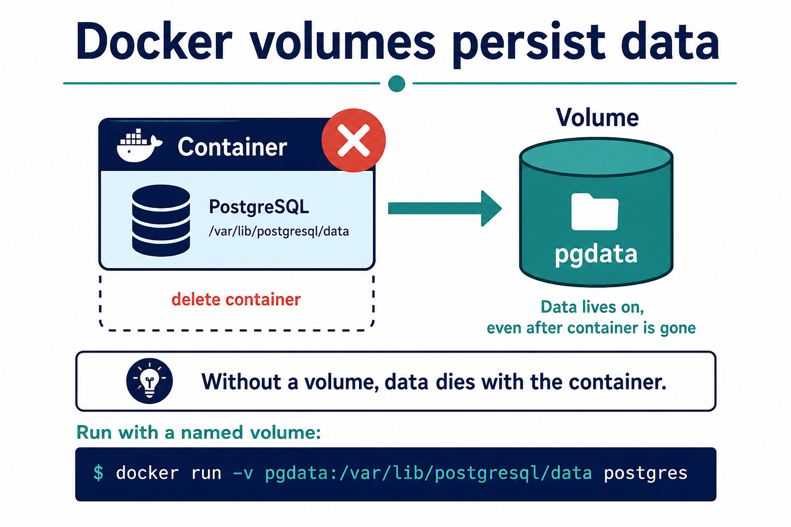

# 03 — Volumes



**Learning objectives**

- Explain why DB data vanishes without a volume
- Use a **named volume**

---

## Three ways to store files

| Type | Example | Use |
| ---- | ------- | --- |
| Container writable layer | default | Disappears when you `docker rm` |
| Named volume | `-v pgdata:/var/lib/postgresql/data` | Databases (preferred) |
| Bind mount | `-v /home/you/site:/usr/share/nginx/html` | Live code on your laptop |

---

## Named volume demo (nginx html)

```bash
docker volume create webdata
docker run -d --name volweb -p 8083:80 \
  -v webdata:/usr/share/nginx/html \
  nginx:alpine
docker exec volweb sh -c 'echo volume-ok > /usr/share/nginx/html/index.html'
curl -s http://localhost:8083
docker rm -f volweb
docker run -d --name volweb2 -p 8083:80 \
  -v webdata:/usr/share/nginx/html \
  nginx:alpine
curl -s http://localhost:8083
```

Expected: `volume-ok` still appears after the first container is deleted.

```bash
docker volume ls
docker volume inspect webdata
```

---

## Knowledge check

1. What happens to Postgres data if you `docker rm` with no volume?
2. Named volume vs bind mount?

<details>
<summary>Answers</summary>

1. Data is gone.
2. Named volume is managed by Docker. Bind mount is a folder on the host.

</details>

➡️ Next: [04 — Networks](./04-Networks.md)
