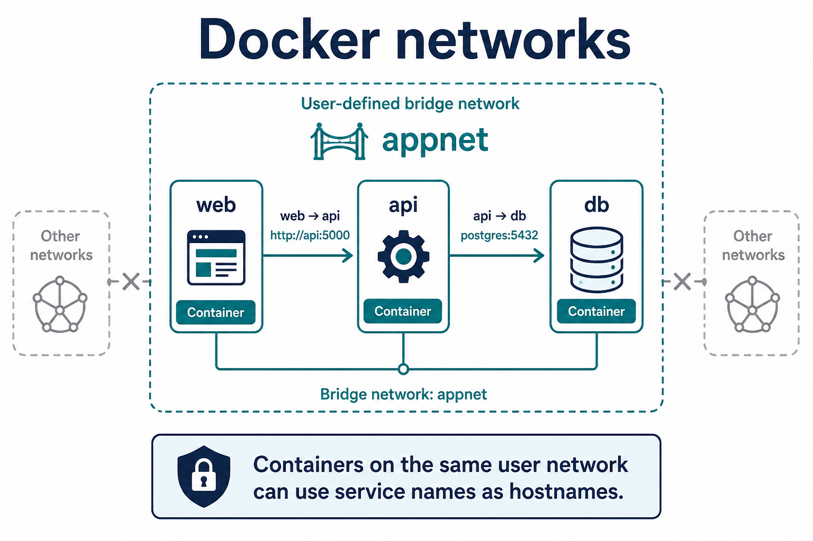

# 04 — Networks



**Learning objectives**

- Create a user-defined bridge network
- Reach another container **by name**

---

## Default bridge vs user network

On the default bridge, automatic DNS names are limited. Create your own network for apps:

```bash
docker network create appnet
docker network ls
```

---

## Two containers on `appnet`

```bash
docker run -d --name web --network appnet campus-hello:1.0
docker run --rm --network appnet curlimages/curl:8.5.0 curl -s http://web
```

The second container calls **http://web** — Docker DNS maps `web` to the first container’s IP.

You do **not** need `-p` for container-to-container traffic. `-p` is for the **host** (browser, Postman).

---

## Knowledge check

1. How does `web` resolve to an IP?
2. Is `-p` required for api → db?

<details>
<summary>Answers</summary>

1. Docker embedded DNS on a user-defined network.
2. No — only if something *outside* Docker must connect.

</details>

➡️ Next: [Lab 03](./Lab-03-Volumes-Networks.md)
