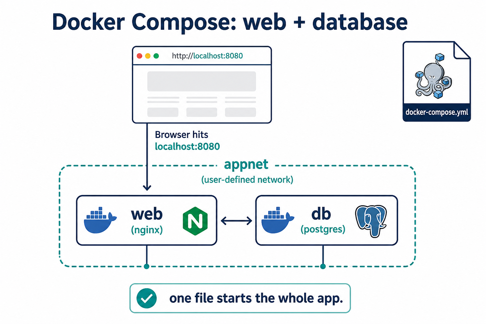

# 01 — Docker Compose



**Learning objectives**

- Read a `compose.yaml`
- `up`, `ps`, `logs`, `down`

Compose is for **more than one container**: web + cache, API + database.

---

## File shape

```yaml
services:
  web:
    build: .
    image: campus-hello:1.0
    ports:
      - "8080:80"
    restart: unless-stopped
```

Course file: `sample-app/stack/compose.yaml` (web + Redis).

---

## Daily commands

From the folder that contains `compose.yaml`:

```bash
docker compose up -d --build
docker compose ps
docker compose logs -f
docker compose down
```

`down` stops and removes the stack containers. Add `-v` only if you also want volumes deleted.

---

## Why Compose in DevOps

- Same stack for every student
- Matches “inner loop” of a real service
- Next step toward Kubernetes (Pods ≈ containers, Services ≈ ports)

---

## Knowledge check

1. `up -d` vs `down`?
2. Where do you run compose commands?

<details>
<summary>Answers</summary>

1. `up -d` starts in background. `down` removes the stack.
2. In the directory with `compose.yaml` (or `-f path`).

</details>

➡️ Next: [02 — Registry](./02-Registry.md)
