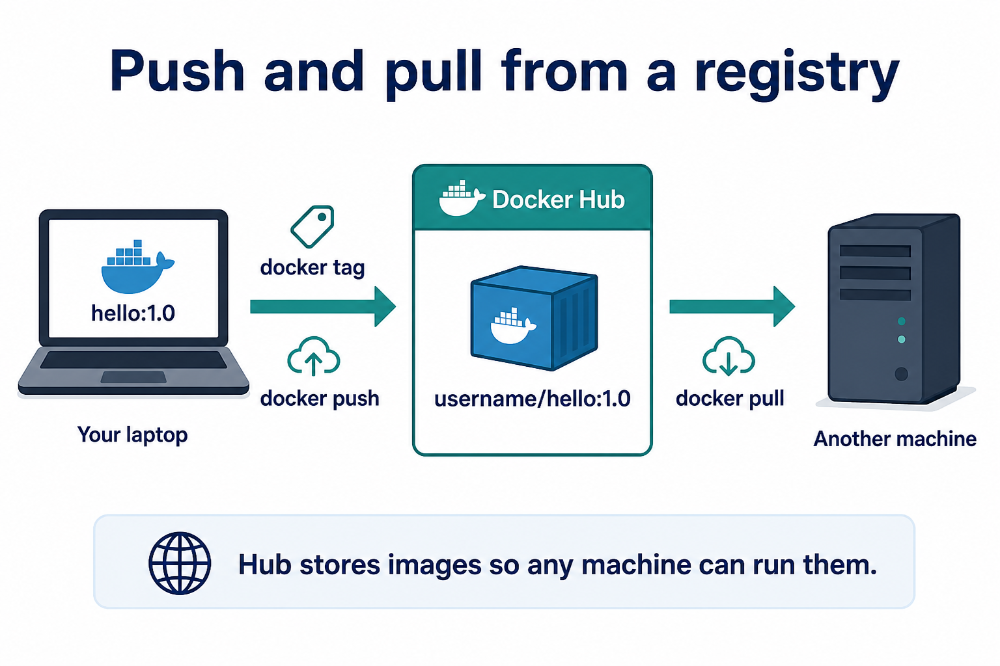

# 02 — Registry and Docker Hub



**Learning objectives**

- Tag an image with your Hub username
- Push and pull

---

## Why a registry?

Your laptop image is local. CI, servers, and classmates need `docker pull`.

| Registry | Typical use |
| -------- | ----------- |
| Docker Hub | Public / class demos |
| Azure Container Registry | Company Azure apps |
| GitHub Container Registry | GitHub Actions |

---

## Tag, login, push

Replace `YOURUSER`:

```bash
docker tag campus-hello:1.0 YOURUSER/campus-hello:1.0
docker login
docker push YOURUSER/campus-hello:1.0
```

On another machine (or after `docker rmi`):

```bash
docker pull YOURUSER/campus-hello:1.0
docker run -d -p 8080:80 YOURUSER/campus-hello:1.0
```

If you cannot create a Hub account in class, stop after `docker tag` and show the names with `docker images`.

---

## Knowledge check

1. Why `tag` before `push`?
2. Is the private key / Hub password stored in the Dockerfile?

<details>
<summary>Answers</summary>

1. Hub needs `username/name:tag`.
2. Never — use `docker login` on the machine, not the image.

</details>

➡️ Next: [03 — Multi-stage](./03-Multi-stage.md)
