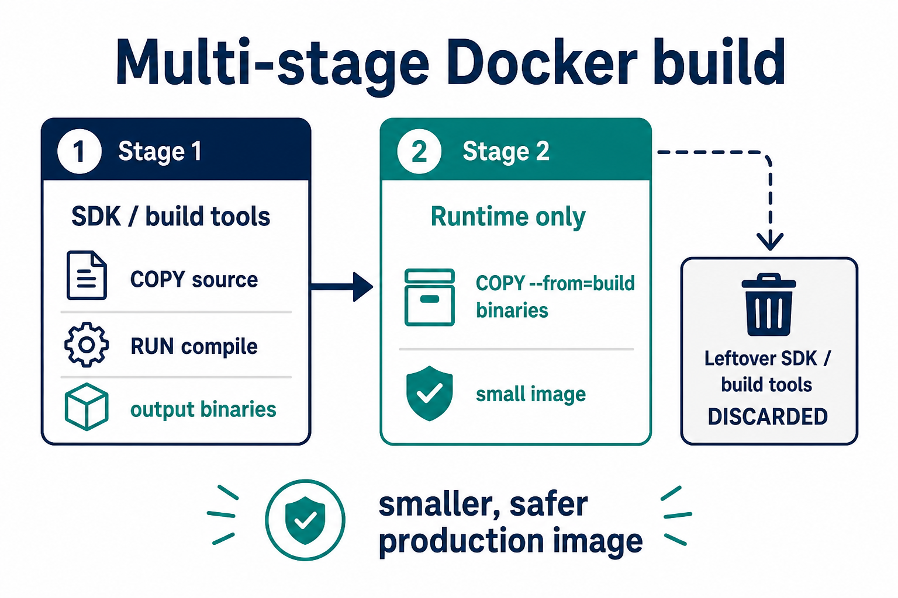

# 03 — Multi-stage builds



**Learning objectives**

- Why production images should not include compilers
- Read a two-stage Dockerfile

---

## The idea

**Stage 1** has SDK / Node / Maven — compile the app.  
**Stage 2** has only the runtime and the output files.

Result: smaller image, fewer tools for attackers, faster pulls.

---

## .NET example (pattern)

This is the pattern used in many Azure / AKS labs:

```dockerfile
FROM mcr.microsoft.com/dotnet/sdk:8.0 AS build
WORKDIR /src
COPY *.csproj ./
RUN dotnet restore
COPY . ./
RUN dotnet publish -c Release -o /app/out

FROM mcr.microsoft.com/dotnet/aspnet:8.0
WORKDIR /app
COPY --from=build /app/out .
ENTRYPOINT ["dotnet", "HelloWorld.dll"]
```

You do **not** need the .NET SDK on Day 4 unless you follow the extra lab. Remember the **pattern**.

---

## nginx sample is already small

`FROM nginx:alpine` is a runtime image. Multi-stage matters when you **compile**.

---

## Knowledge check

1. What does `COPY --from=build` do?
2. Why drop the SDK from the final image?

<details>
<summary>Answers</summary>

1. Copies files from a previous named stage, not from your laptop.
2. Smaller image and no compiler in production.

</details>

➡️ Next: [Lab 04](./Lab-04-Compose-Push.md)
