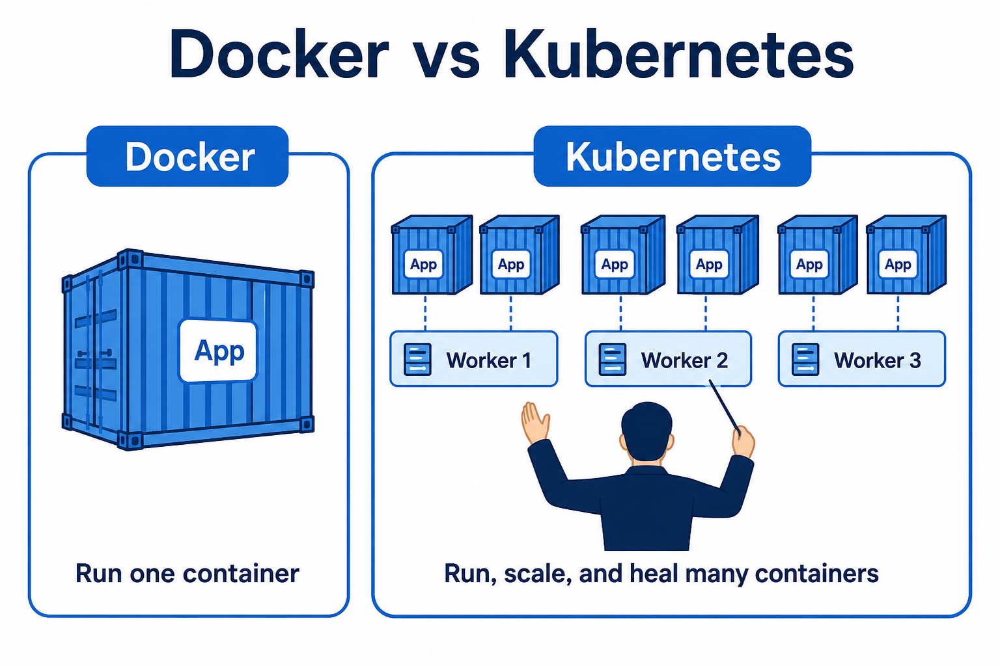

# 01 — Why Kubernetes

**Learning objectives**

- Explain the problem Docker alone does not solve
- Use one everyday analogy
- Say what Kubernetes does in one sentence

---

## One-sentence idea

**Docker runs a container. Kubernetes runs a *fleet* of containers** — start them, spread them on machines, replace them when they crash.

---

## Everyday analogy: a hotel

Imagine a hotel.

| Hotel | Kubernetes |
| ----- | ---------- |
| Guests | Your apps (containers) |
| Rooms | Worker machines (nodes) |
| Front desk | API server (takes requests) |
| Manager | Controllers (keep the plan) |
| Booking book | etcd (memory of “what should exist”) |

You do not walk floor by floor putting guests in rooms. You tell the desk: “I need 3 rooms for the blue team.” The hotel assigns rooms and finds a new room if a guest leaves.

**Example:** you want **3 copies** of a website. One laptop dies at 2 a.m. Kubernetes starts a replacement on another machine. You sleep.

---

## What Docker already gave us

From the Docker course: an **image** is a recipe, a **container** is a running copy.

Docker is excellent on **one** machine. Real companies have:

- many machines
- many apps
- need to update without downtime
- need a public URL

That extra layer is **Kubernetes** (often written **k8s** — K, then 8 letters, then s).

Inspired by [Kubelabs](https://collabnix.github.io/kubelabs/) “from the ground up” labs. After class, the [CNCF Phippy story](https://www.cncf.io/phippy/the-childrens-illustrated-guide-to-kubernetes/) is the easiest extra reading for non-IT students.

---

## Knowledge check

1. If Docker already runs nginx, why add Kubernetes?
2. Who is the “hotel manager” in the analogy?
3. Does Kubernetes replace Docker images?

Answers

1. Many machines, restarts, scaling, and a standard way to describe “I want 3 copies.”
2. Controllers + API — they keep the desired state.
3. No. Kubernetes *runs* those images as Pods.

➡️ Next: [Lab 01A](./Lab-01A-Explain.md)
