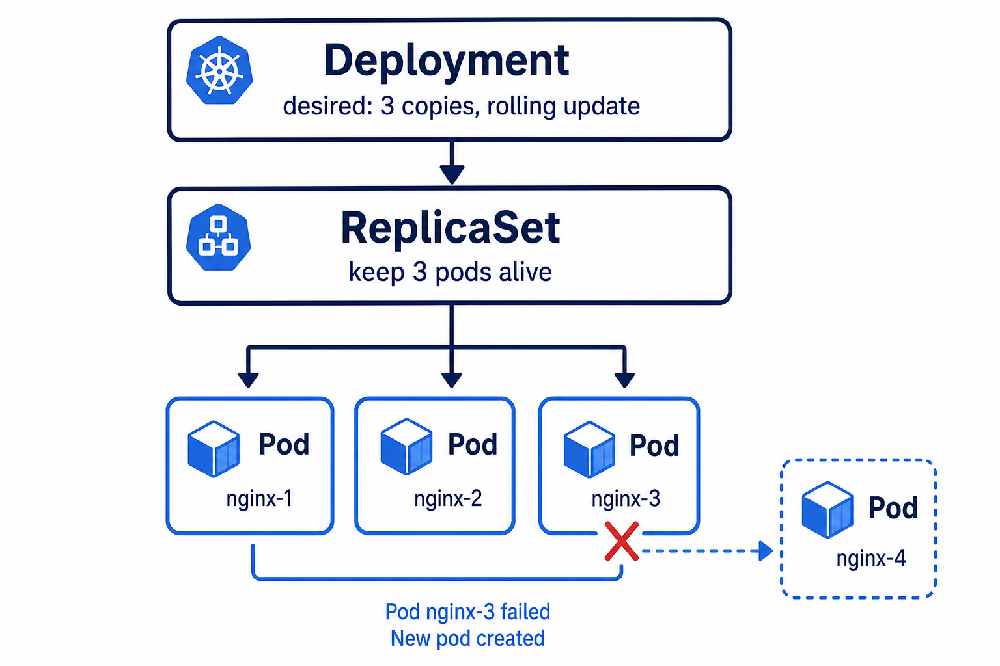

# 01 — ReplicaSet (keep N copies)

**Learning objectives**

- A **ReplicaSet** is a babysitter: “always 3 Pods with this sticker”
- If you delete one Pod, a new one is born

---

## One-sentence idea

A ReplicaSet is the hotel rule: **always 3 blue-team rooms occupied.**

---

## Everyday analogy: photocopies

You set the copier to **3 copies**. If someone throws one page away, the machine prints another (Kubernetes starts a new Pod).

You rarely create ReplicaSets by hand. **Deployments** create them for you. We still look at one so the picture is clear.

---

## Knowledge check

1. You asked for 3 replicas and delete 1 Pod. How many do you see after a few seconds?
2. Does a ReplicaSet do rolling updates by itself in daily class work?

Answers

1. 3 again.  
2. We use a **Deployment** for updates; ReplicaSet mainly keeps count.

➡️ Next: [Lab 04A](./Lab-04A-ReplicaSet.md)
