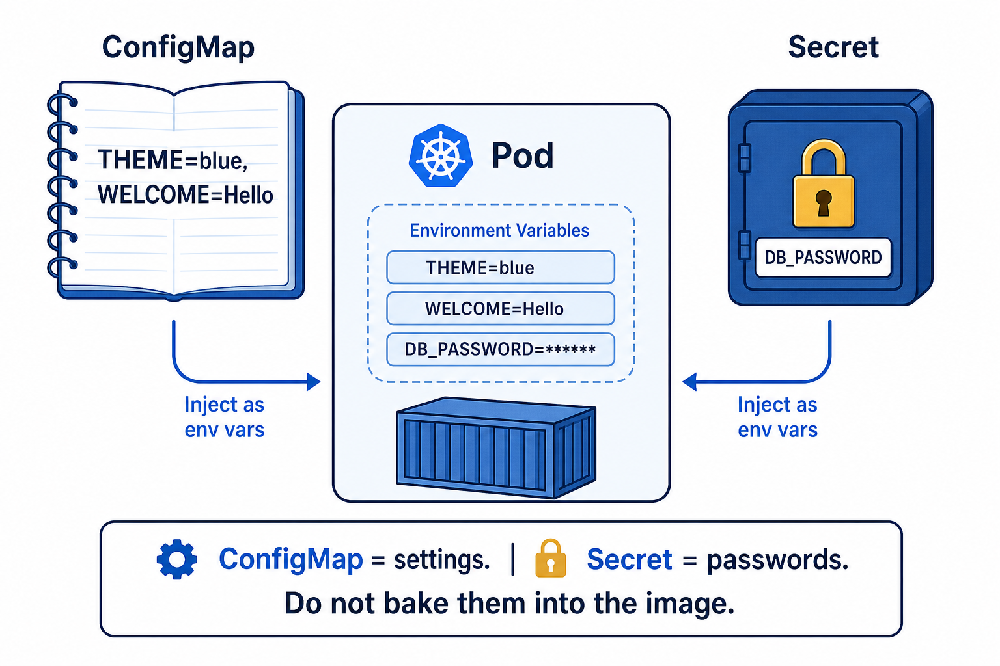

# 01 — ConfigMap (settings, not passwords)

**Learning objectives**

- Put **settings** outside the image
- Change them without `docker build`

---

## One-sentence idea

A ConfigMap is a **sticky note** on the fridge: theme, language, welcome text.

---

## Everyday analogy: TV settings

The TV (image) stays the same. You change **volume / language** without buying a new TV.

**Example:** `WELCOME=Hello class` is injected as an environment variable.

Do **not** put passwords in ConfigMaps. That is tomorrow’s twin: **Secret**.

---

## Knowledge check

1. Should the database password live in a ConfigMap?
2. Do you need a new nginx image to change `WELCOME`?

Answers

1. No — Secret.  
2. No.

➡️ Next: [Lab 06A](./Lab-06A-ConfigMap.md)
