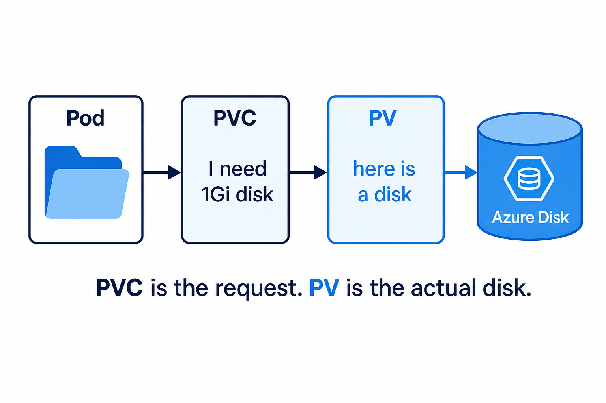

# 01 — Volumes (saving files)

**Learning objectives**

- Container files **die with the Pod** unless you attach a volume
- **PVC** = “I need a disk.” **PV** = the actual disk

---

## One-sentence idea

A volume is a **USB stick** you plug into the Pod.

---

## Everyday analogy: school exam paper

If you write only on a whiteboard (container disk), the cleaner wipes it (Pod delete). If you save on Google Drive (**PVC** on Azure Disk), it stays.

**emptyDir** = whiteboard shared for the life of *this* Pod. Good for labs. **PVC** = real disk (Day 9 AKS can use Azure Disk).

---

## Knowledge check

1. You `kubectl delete pod` with only emptyDir. Is the file still there?
2. Who requests size: PV or PVC?

Answers

1. No.  
2. PVC (the request). PV is the actual volume.

➡️ Next: [Lab 07A](./Lab-07A-Volume.md)
