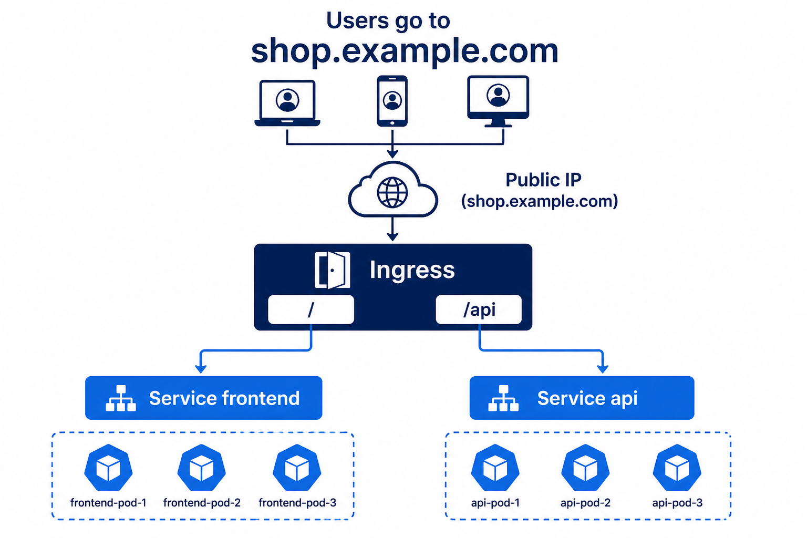

# 02 — Ingress (one front door)

**Learning objectives**

- **Service** is a phone number for one app
- **Ingress** is the **building reception**: host/path → which Service

---

## One-sentence idea

Ingress: **shop.example.com/** goes to the shop, **/api** goes to the API — one public door.

---

## Everyday analogy: shopping mall

One address. Directory downstairs: Food court / Cinema. Ingress rules are that directory.

You also need an **Ingress Controller** (nginx, etc.). YAML alone is a sign on the wall; the controller is the receptionist who reads it.

On AKS, people often install **ingress-nginx** (see [aks-workshops workshop 2](https://github.com/sshabb697/aks-workshops)).

---

## Knowledge check

1. Does `kind: Ingress` work with no controller?
2. Is Ingress the same as LoadBalancer?

Answers

1. No useful traffic — you need a controller.  
2. No. LoadBalancer is a Service type. Ingress sits in front of Services.

➡️ Next: [Lab 07B](./Lab-07B-Ingress.md)
