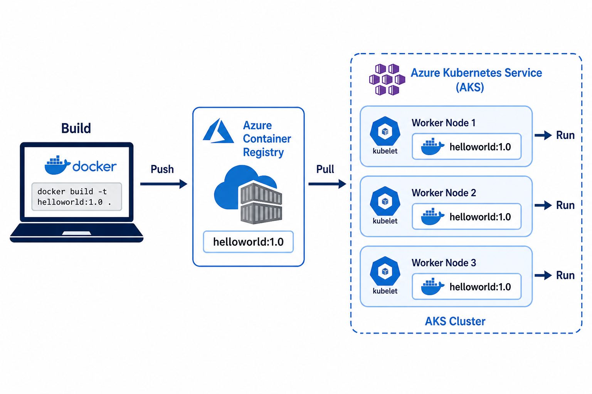

# 02 — ACR and AKS

**Learning objectives**

- **ACR** = private Docker Hub on Azure
- AKS must be **allowed** to pull (attach ACR)

---

## One-sentence idea

Build image → **ACR** (warehouse) → AKS nodes **pull** and run.

---

## Example names

ACR names must be **globally unique** (letters and numbers only):

`k8sclass84721acr`

We attach ACR when we create AKS (`--attach-acr`) so nodes can pull private images — same idea as [aks-workshops lab-01](https://github.com/sshabb697/aks-workshops) and [02.basic-aks](https://github.com/sshabb697/aks-workshop/blob/main/content/labs/02.basic-aks.md).

---

## Knowledge check

1. Why not only Docker Hub for company apps?
2. What flag links AKS to ACR?

Answers

1. Private images, control, Azure integration.  
2. `--attach-acr` (or `az aks update --attach-acr` later).

➡️ Next: [Lab 08B](./Lab-08B-Create-AKS.md)
