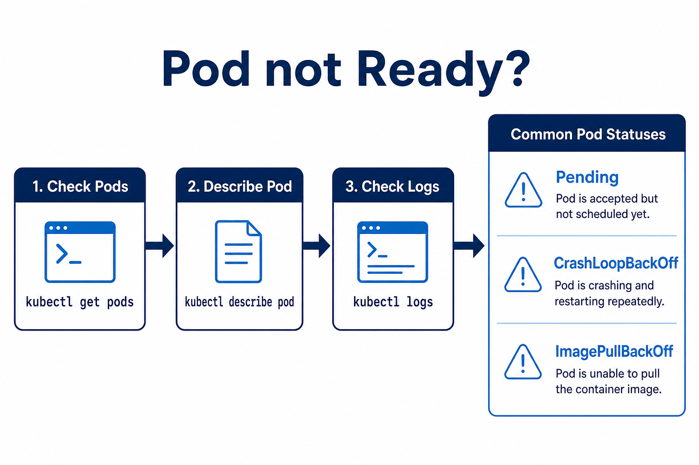

# 02 — Troubleshoot (the 5-command habit)

**Learning objectives**

- Follow a fixed order when a Pod is not Ready

---

## One-sentence idea

**get → describe → logs** before you Google.

| Status | Simple meaning |
| ------ | -------------- |
| Pending | No room, or still pulling image |
| ImagePullBackOff | Wrong image name or no ACR permission |
| CrashLoopBackOff | App starts then dies — read logs |
| Running | Good |

[Kubelabs CrashLoopBackOff article](https://collabnix.github.io/kubelabs/) is extra reading for tutors.

---

## Knowledge check

1. First command when a student says “it’s broken”?
2. ImagePullBackOff — is the app crashing?

Answers

1. `kubectl get pods -n class`  
2. No — it never started; pull failed.

➡️ Next: [Lab 10B](./Lab-10B-Capstone-Cleanup.md)
