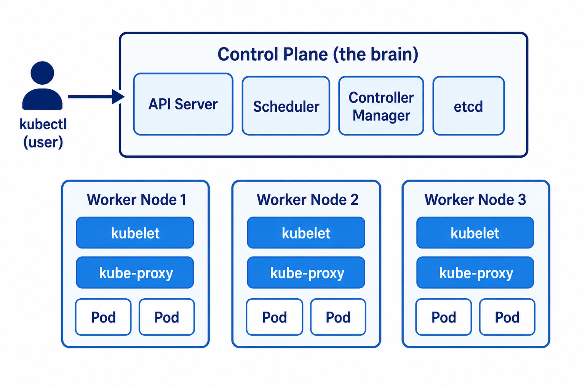

# Day 1 — Why Kubernetes
## 60 minutes

**Today:** a picture in your head. No cluster yet.

---

# Today’s two lessons

**A.** Why Docker is not enough  
**B.** Brain (control plane) and hands (worker nodes)

After each lesson → a **lab** (talk / draw).

---

# The problem

You can run nginx with Docker on **one** computer.

Companies have:

- many computers
- many apps
- need 3 copies, not 1
- need a restart at 2 a.m.

That extra helper is **Kubernetes** (also written **k8s**).

---

# Picture: one container vs many


---

# Hotel story (easy to remember)

| Hotel | Kubernetes |
|-------|------------|
| Guests | Your apps |
| Rooms | Worker computers (**nodes**) |
| Front desk | API server (takes your request) |
| Manager | Controllers (keep the plan) |
| Booking book | **etcd** (memory) |

You say: “I need **3** rooms for the blue team.”  
The hotel finds rooms. If a guest leaves, they fill the room again.

---

# One sentence to remember

> Kubernetes keeps the number of copies I asked for,  
> and starts a new copy if one dies.

---

# Lab 01A — 15 minutes

**No computer cluster.** Paper or whiteboard.

1. Fill the table: Container / Kubernetes / Node / Desired state
2. Tell a partner the hotel story (60 seconds)
3. True or false: “Kubernetes builds Docker images” → **False**

Open: `Day-01-Why-Kubernetes/Lab-01A-Explain.md`

---

# Lesson B — the cluster has two parts



---

# Brain vs hands

| Piece | Job | Simple word |
|-------|------|-------------|
| **Control plane** | Decide | Brain |
| **Worker node** | Run apps | Hands |
| **kubelet** | Starts the Pod on a node | Housekeeping |
| **etcd** | Saves “what should exist” | Memory |

On **Azure AKS** (Day 8), Azure runs the brain for you.

---

# What happens when you type a command (preview)

```bash
kubectl run demo --image=nginx
```

1. `kubectl` talks to the **API server**
2. **Scheduler** picks a worker with space
3. **kubelet** starts a **Pod** (nginx)

You do not log in to every machine by hand.

---

# Lab 01B — 15 minutes

Open the architecture picture.

Circle:

1. You (`kubectl`)
2. API server
3. etcd
4. One worker
5. A Pod

Finish: “Tomorrow kubectl talks to the ________.”  
Answer: **API server**

---

# Recap (ask the class)

1. Why add Kubernetes if Docker already runs nginx?
2. Do containers each have their own full OS like a VM?
3. Who runs the control plane on AKS — you or Azure?

**Homework:** one sentence definition of Kubernetes in your own words.
