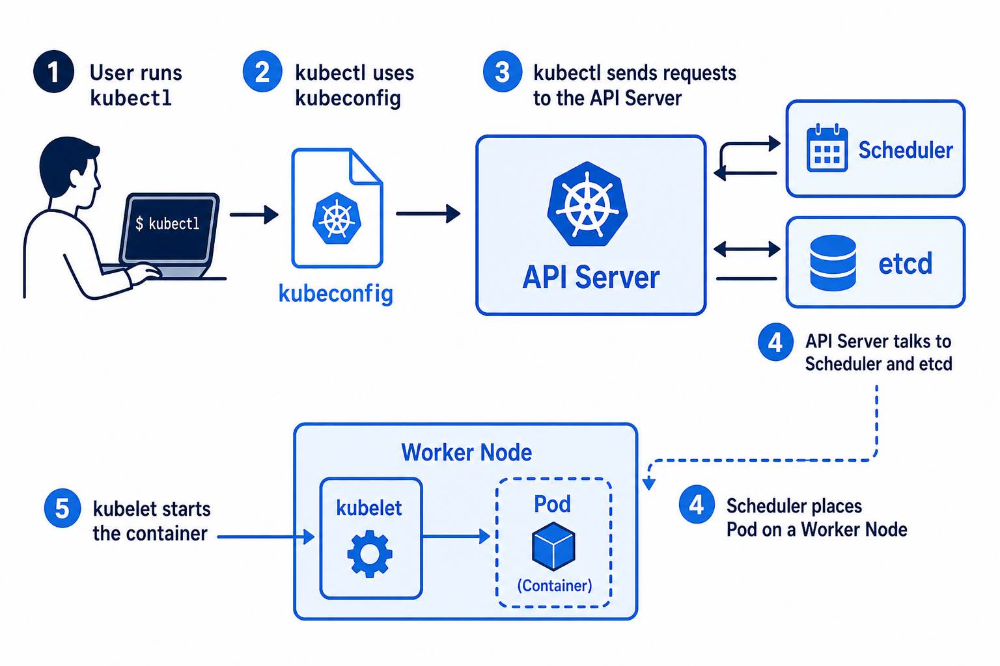

# Day 2 — Cluster and kubectl
## Make the cluster. Talk to it.

**Today’s win:** `kubectl get nodes` shows **Ready**

---

# kubectl is a remote control



The remote is not the TV.  
Wrong cluster file = buttons do nothing.

---

# Words you will type a lot

| Command | Meaning |
|---------|---------|
| `kubectl get nodes` | List the machines |
| `kubectl get pods` | List the running apps |
| `kubectl apply -f file.yaml` | “Make the cluster match this list” |

---

# Try these two

```bash
kubectl version --client
kubectl get nodes
```

You want: at least one node, status **Ready**.

---

# Lab 02A — 15 minutes

**Turn Kubernetes on** (pick one):

1. **Docker Desktop** → Settings → Kubernetes → Enable
2. Or: `minikube start`

Then:

```bash
kubectl get nodes
```

If it fails: wait (first start is slow). Restart Docker. Open a new terminal.

---

# Lesson B — Namespace = a folder

**default** = your locker (class apps)  
**kube-system** = staff only → **do not delete**

Two teams can both have a pod named `web`  
if they live in **different folders**.

```bash
kubectl get namespaces
```

---

# Lab 02B — 15 minutes

```bash
kubectl cluster-info
kubectl get nodes -o wide
kubectl get ns
kubectl get pods -A
```

Then create and delete a practice folder:

```bash
kubectl create namespace class-day2
kubectl delete namespace class-day2
```

`-A` = all folders. System pods are normal.

---

# Recap

1. kubectl talks to the **API server**
2. **Ready** on a node = that machine can run apps
3. Never put class apps in `kube-system`

**Tomorrow:** your first **Pod** (nginx).
