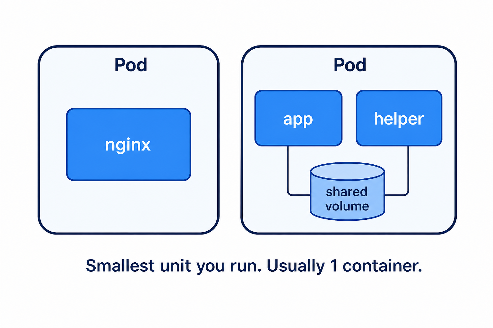

# Day 3 — Pods
## The smallest thing Kubernetes runs

**Today’s win:** nginx page in the browser + `kubectl exec`

---

# A Pod is a lunchbox



The sandwich = **container** (nginx).  
The lunchbox = **Pod**.  
Kubernetes moves lunchboxes, not loose sandwiches.

---

# Usually one container per Pod

Two containers in one Pod only if they **must** share:

- the same network, or
- the same small disk

Beginners: **one container**. Keep it simple.

---

# Example YAML (the shopping list)

```yaml
apiVersion: v1
kind: Pod
metadata:
  name: nginx-demo
  labels:
    app: nginx
spec:
  containers:
    - name: web
      image: nginx
      ports:
        - containerPort: 80
```

Same idea as `docker run nginx`.

---

# Lab 03A — 15 minutes

Folder: `Day-03-Pods/`

```bash
kubectl apply -f nginx-pod.yaml
kubectl get pods
kubectl port-forward pod/nginx-demo 8080:80
```

Browser: **http://localhost:8080**

Leave `port-forward` running. Stop with `Ctrl+C` when done.

Then: `kubectl describe pod nginx-demo` — find **Node**.

---

# Lesson B — stickers and exec

**Labels** = stickers. Example: `app: nginx`  
Tomorrow a Service will look for that sticker.

**exec** = open a shell **inside** the Pod (not SSH to the whole laptop).

```bash
kubectl exec -it nginx-demo -- sh
```

---

# Important pain (on purpose)

```bash
kubectl delete pod nginx-demo
```

Nothing brings it back.

That is why real work uses a **Deployment** (Day 4), not a naked Pod.

---

# Lab 03B — 15 minutes

```bash
kubectl get pods --show-labels
kubectl get pods -l app=nginx
kubectl exec -it nginx-demo -- nginx -v
kubectl logs nginx-demo
kubectl delete pod nginx-demo
```

Tutor question: “Who recreates it?” → **Nobody. Until tomorrow.**

---

# Recap

1. Pod = wrapper around the container
2. Labels help other objects **find** the Pod
3. A lone Pod does **not** self-heal

**Tomorrow:** babysitter (ReplicaSet) + project plan (Deployment).
