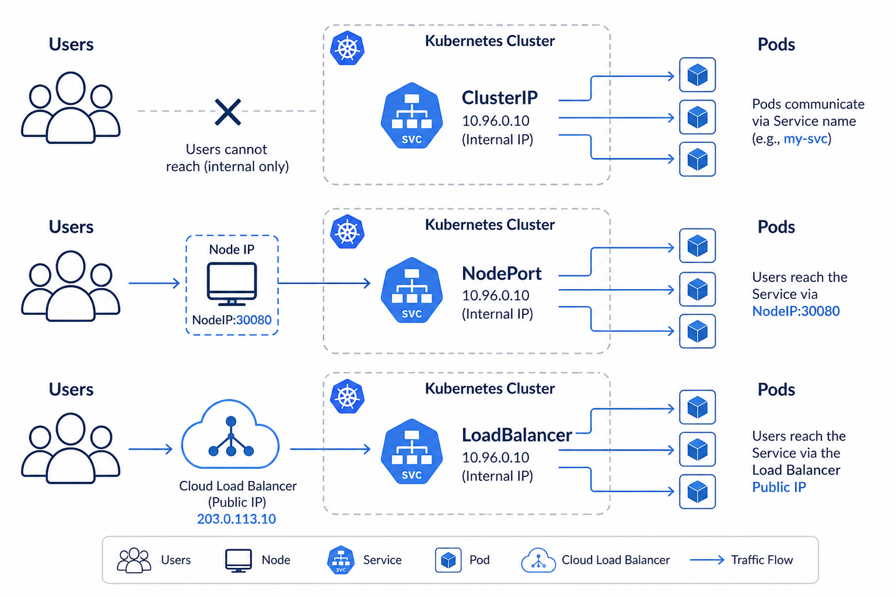

# Day 5 — Services
## A stable phone number for changing Pods

**Today’s win:** explain why Pod IPs change, but the Service name does not.

---

# Problem: Pod IPs die

When a Pod restarts, it gets a **new IP**.

If you bookmarked the old IP, the bookmark breaks.

A **Service** is a stable name in front of Pods that share a **label**.

---

# Picture: three ways to expose



---

# Pizza shop story

Chefs (Pods) come and go.

The **shop phone number** (Service) stays.

Callers do not need each chef’s personal number.

The Service finds chefs with sticker `app: hello`.

---

# Lab 05A — ClusterIP — 15 minutes

Need Deployment `hello` from Day 4.

```bash
kubectl apply -f hello-svc.yaml
kubectl get svc hello
kubectl describe svc hello
kubectl port-forward svc/hello 8080:80
```

Look for **Endpoints** (Pod IPs).

Browser: **http://localhost:8080**

ClusterIP = **inside** the cluster only. That is why we port-forward.

---

# Three types (simple)

| Type | Who can use it | When |
|------|----------------|------|
| **ClusterIP** | Other Pods | Default, internal |
| **NodePort** | A high port on the machine | Local demo |
| **LoadBalancer** | Internet (cloud public IP) | **Day 9 AKS** |

---

# Lab 05B — NodePort — 15 minutes

```bash
kubectl apply -f hello-nodeport.yaml
kubectl get svc hello-nodeport
```

Docker Desktop: try **http://localhost:30080**

If it fails, port-forward again. That is OK.

You may delete `hello-nodeport`. Keep the Deployment.

---

# Recap

1. Service selector must match Pod **labels**
2. ClusterIP is not a public website
3. LoadBalancer = Azure gives a public IP (costs a little)

**Tomorrow:** settings and passwords **outside** the image.
