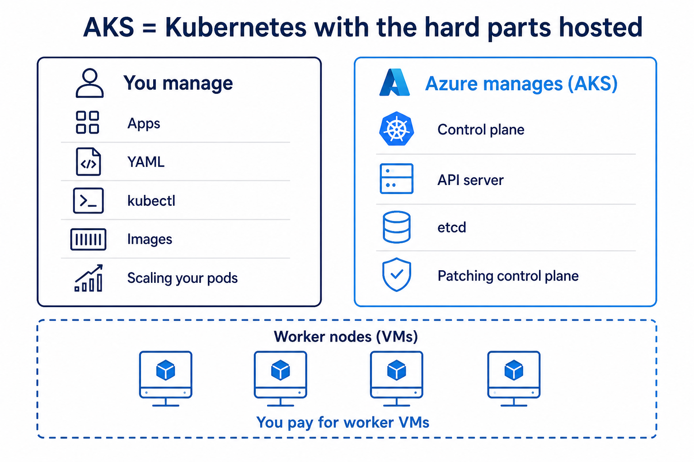

# Day 8 — AKS cluster
## Azure runs the brain. You pay for the hands.

**Today’s win:** `kubectl get nodes` on **Azure**, not Docker Desktop.

**Money:** 1 small node. Delete on Day 10.

---

# What AKS is



You still write YAML.  
Azure runs API server + etcd.  
You pay for **worker VMs**.

---

# Rented kitchen story

You cook (deploy apps).  
Azure owns the building power (control plane).  
You rent the cook stations (**nodes**).

Same **kubectl** as Days 2–7.  
Only the **target cluster** changes.

---

# Two resource groups (normal)

1. **Yours** — `k8s-class-rg` (AKS name, ACR)
2. **MC_...** — Azure-managed node stuff

Do not panic if search shows two groups.

---

# Lab 08A — 15 minutes

Need: Azure account + `az` CLI (or [Cloud Shell](https://shell.azure.com))

```bash
az login
az account show
az group create -n k8s-class-rg -l eastus
az aks install-cli
kubectl version --client
```

Check you are on the **class subscription**.

---

# ACR = private image warehouse


Build → **ACR** → AKS **pulls** and runs.

AKS needs permission: `--attach-acr`

---

# Lab 08B — start create early

Create can take **10–15 minutes**. Start it, then wait.

```bash
NUMBER=$RANDOM
ACR="k8sclass${NUMBER}acr"
az acr create -g k8s-class-rg -n $ACR --sku Basic

az aks create -g k8s-class-rg -n aks-class \
  --node-count 1 --node-vm-size Standard_B2s \
  --generate-ssh-keys --attach-acr $ACR
```

Then:

```bash
az aks get-credentials -g k8s-class-rg -n aks-class --overwrite-existing
kubectl get nodes
```

**Do not create a second cluster** if this is still running.

---

# Recap

1. AKS ≠ free
2. kubectl context must be **aks-class**
3. Write down your ACR name

**Tomorrow:** deploy nginx and open a **public IP**.
