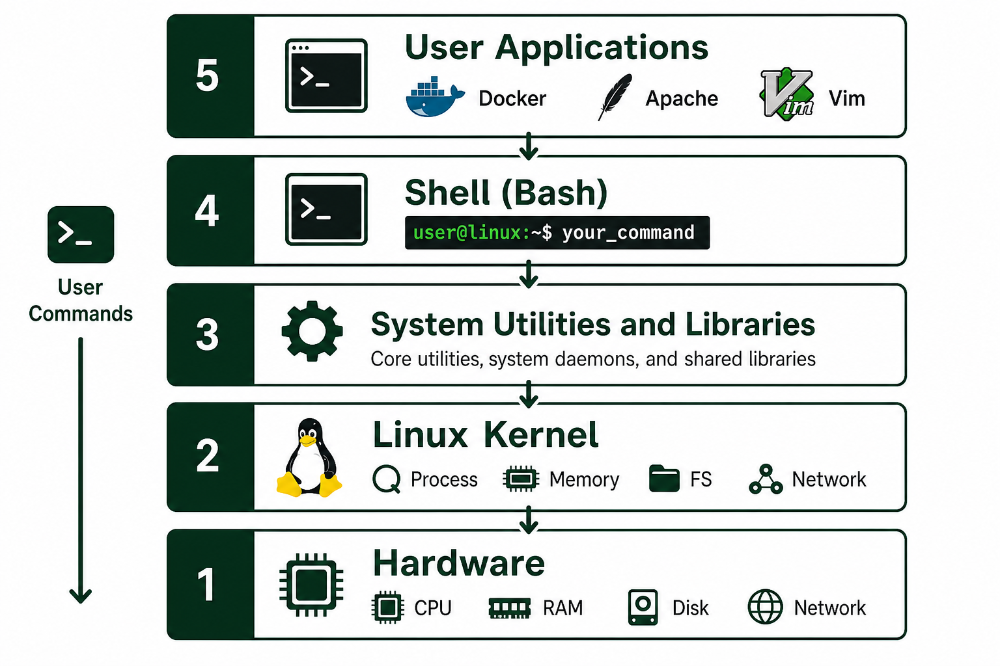

# 02 — Linux Architecture

## The layers (visual)



---

## Layer by layer

### 1. Hardware
CPU, RAM, disk, network card — physical or virtual (VM/hypervisor).

### 2. Linux kernel
Core of the OS. Manages:
- **Processes** — who runs when
- **Memory** — RAM allocation
- **Filesystem** — read/write storage
- **Network** — packets in/out
- **Device drivers** — talk to hardware

### 3. System libraries & utilities
Shared code (`glibc`) and commands like `ls`, `cp`, `systemctl`.

### 4. Shell
Your command interpreter — usually **Bash**. You type commands; shell calls the kernel.

### 5. User applications
Browsers, `docker`, `nginx`, VS Code, your scripts.

---

## Boot sequence (awareness)

```
Power on → Firmware (BIOS/UEFI) → Bootloader (GRUB)
         → Kernel loads → systemd (PID 1) → services → login prompt
```

When a server “won’t boot,” admins check GRUB, disk, and systemd — Day 4 covers services.

---

## Kernel vs shell vs application

| You type… | Handled by… |
| --------- | ----------- |
| `ls -la` | Shell runs `/usr/bin/ls` |
| `systemctl restart nginx` | Shell → systemd → nginx service |
| `docker run` | Shell → docker daemon → container |

---

## Knowledge check

1. What does the kernel manage?
2. What is PID 1 on modern Linux?
3. Where does Bash fit in the stack?

➡️ Next: [03 — Setup WSL / VM](./03-Setup-WSL-VM.md)
