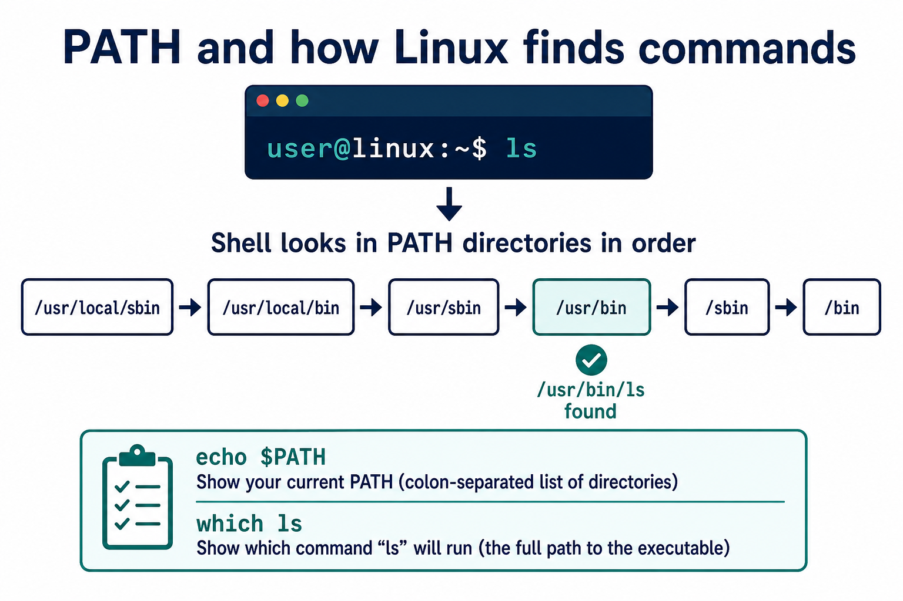

# 04 — Shell Basics

**Learning objectives**

- Navigate with absolute and relative paths
- Create, copy, move, and view files
- Understand how the shell **finds** a command (`PATH`)

Practice every command in your terminal.

---

## Where am I?

```bash
pwd          # print working directory
whoami       # current user
hostname     # machine name
```

---

## List and inspect

```bash
ls              # list files
ls -l           # long format (permissions, size, date)
ls -la          # include hidden files (start with .)
ls -lt          # sort by time modified
ls -ltr         # oldest first
```

Hidden files start with `.` — examples: `.bashrc`, `.ssh`.

---

## Change directory

```bash
cd /home/you/projects    # absolute path (from /)
cd projects              # relative path (from current dir)
cd ..                    # up one level
cd ~                       # home directory
cd -                       # previous directory
```

### Absolute vs relative path

| Type | Starts with | Example |
| ---- | ----------- | ------- |
| Absolute | `/` | `/home/student/linux-course` |
| Relative | current dir | `day01/lab` |

**Try this:** `pwd`, then `cd /tmp`, then `cd -`. You should return to the previous folder.

---

## Create directories and files

```bash
mkdir asia
mkdir europe africa america
mkdir -p asia/india/mumbai    # parent folders created automatically

touch notes.txt               # empty file
echo "Hello Linux" > hello.txt
cat hello.txt
```

`>` **overwrites**. `>>` **appends**. Day 2 covers this in depth.

---

## Copy, move, delete

```bash
mkdir -p backup
cp hello.txt backup/hello.txt
cp -r asia asia-copy          # recursive (directories)

mv notes.txt notes-old.txt    # rename
mv hello.txt backup/          # move

rm notes-old.txt              # delete file
rm -r asia-copy               # delete directory (careful!)
```

**Never** run `rm -rf /` or `rm -rf *` from `/`. There is no Recycle Bin.

---

## View file content

```bash
cat file.txt        # full file (small files)
less file.txt       # scrollable (q to quit)
head -n 5 file.txt  # first 5 lines
tail -n 20 file.txt # last 20 lines
```

---

## How Linux finds commands (`PATH`)



When you type `ls`, the shell does **not** magically know `ls`. It searches directories listed in `$PATH`.

```bash
echo $PATH
which ls          # usually /usr/bin/ls
type ls
```

If you write a script in `~/bin` and it is “not found,” either use `./myscript.sh` or add that folder to `PATH`.

---

## Get help

```bash
man ls              # manual page (q to quit)
ls --help           # quick help
whatis ls
```

---

## Command history & shortcuts

| Shortcut | Action |
| -------- | ------ |
| `↑` / `↓` | Previous/next command |
| `Tab` | Auto-complete |
| `Ctrl + C` | Cancel running command |
| `Ctrl + L` | Clear screen |
| `Ctrl + R` | Search history |
| `history` | Show command history |
| `history \| grep mkdir` | Find an old command |

Optional aliases (add to `~/.bashrc`, then `source ~/.bashrc`):

```bash
alias ll='ls -la'
alias gs='git status'
```

---

## Common mistakes

| You typed | What happened |
| --------- | ------------- |
| `cd linux-course` from the wrong folder | `No such file or directory` — `pwd` then use `~/linux-course` |
| `cat Hello.txt` | Linux is **case-sensitive** |
| `rm -r folder` without checking | Folder is gone — pause before `-r` |

---

## Knowledge check

1. Difference between `cp` and `mv`?
2. What does `mkdir -p a/b/c` do?
3. How do you list hidden files?
4. Why might `myscript.sh` say “command not found”?

<details>
<summary>Answers</summary>

1. `cp` copies (original remains). `mv` moves or renames (original path gone).
2. Creates `a`, `a/b`, and `a/b/c` even if parents do not exist.
3. `ls -la` (or `ls -a`).
4. The current directory is usually **not** in `PATH`. Run `./myscript.sh` after `chmod +x`.

</details>

➡️ Next: [05 — Filesystem Hierarchy](./05-Filesystem-Hierarchy.md)
