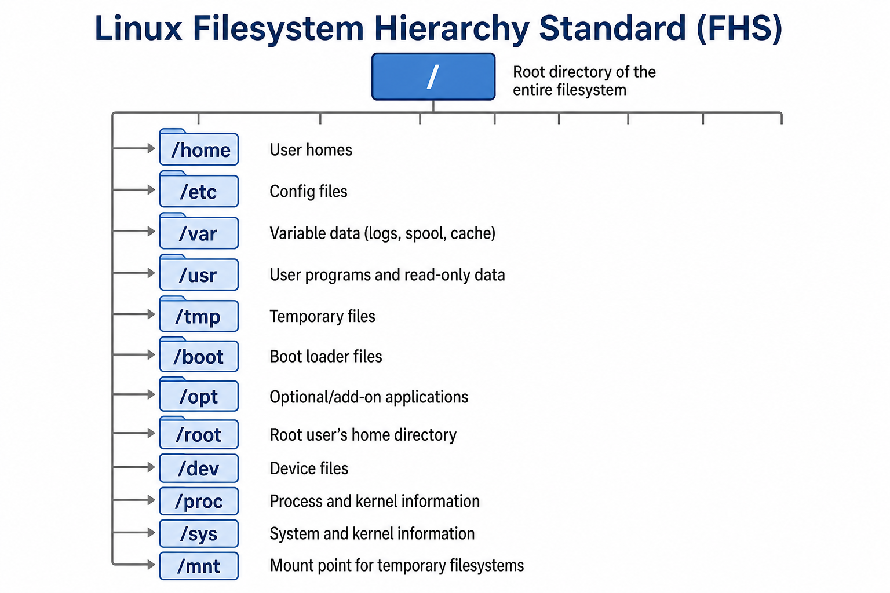

# 05 — Filesystem Hierarchy (FHS)

Linux stores everything under **/** (root). There are no `C:` and `D:` drives — one tree.



---

## Directories you use daily

| Path | Purpose | DevOps example |
| ---- | ------- | -------------- |
| `/` | Root of filesystem | — |
| `/home/<user>` | User home directories | Your code, SSH keys |
| `/root` | root user home | Admin-only |
| `/etc` | Configuration files | `nginx.conf`, `ssh/sshd_config` |
| `/var` | Variable data (logs, cache) | `/var/log`, web roots |
| `/var/log` | Log files | `syslog`, `auth.log` |
| `/tmp` | Temporary files | Cleared on reboot |
| `/usr` | User programs & libraries | `/usr/bin`, `/usr/local` |
| `/opt` | Optional third-party apps | Commercial software |
| `/bin`, `/sbin` | Essential binaries | `ls`, `systemctl` |
| `/dev` | Device files | Disks, null device |
| `/proc` | Process/kernel info (virtual) | `cat /proc/cpuinfo` |
| `/sys` | Hardware/kernel info (virtual) | — |

---

## Explore on your machine

```bash
ls /
ls /etc | head
ls /var/log
ls -la ~
echo $HOME
```

---

## Config vs data vs logs (pattern)

```
/etc/myapp/config.yml     ← static configuration
/var/lib/myapp/           ← application data
/var/log/myapp/           ← logs
/tmp/                     ← short-lived temp
```

When troubleshooting: **config** in `/etc`, **errors** in `/var/log`.

---

## Knowledge check

1. Where are system logs usually stored?
2. Where is your home directory?
3. What lives under `/etc`?

➡️ Next: [Lab 01 — Shell Navigation](./Lab-01-Shell-Navigation.md)
