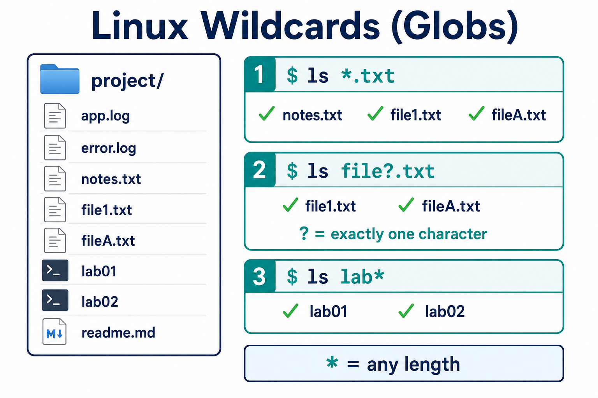
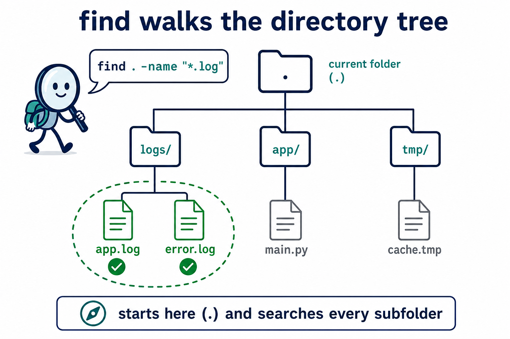
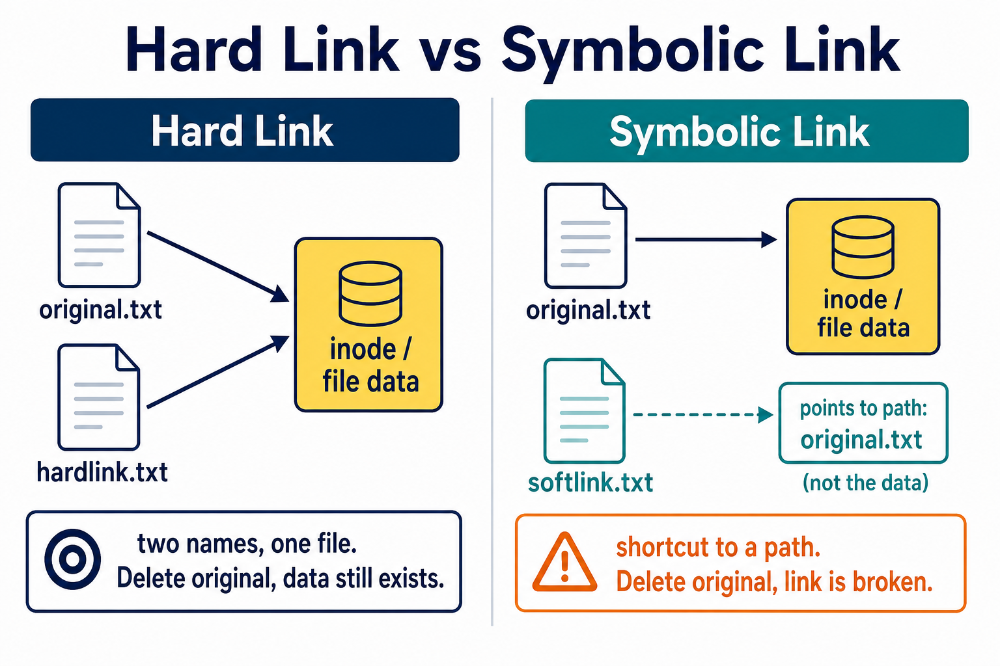
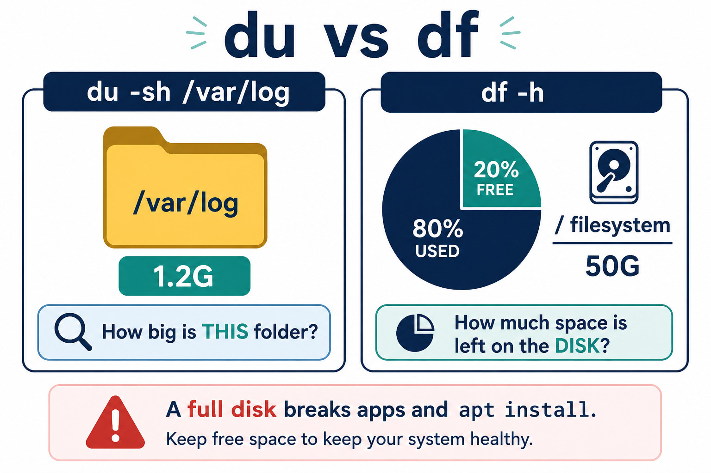
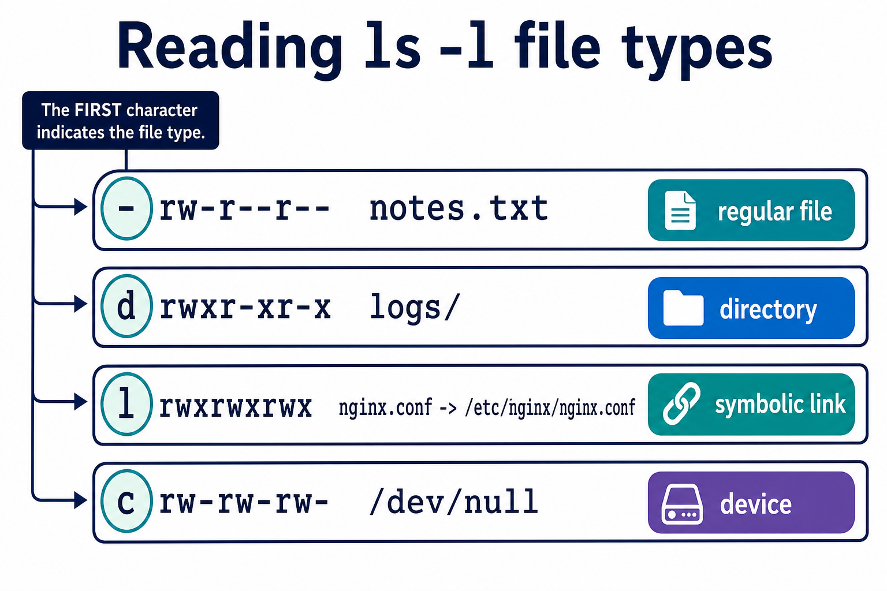

# 01 — File Management (Advanced)

Beyond Day 1 basics — links, wildcards, and finding files.

**Learning objectives**

- Match files with globs (`*`, `?`)
- Find files by name, type, and age
- Explain symlink vs hard link

---

## Wildcards (globs)



```bash
ls *.txt              # all .txt in current dir
ls lab*               # starts with lab
ls file?.txt          # file1.txt, fileA.txt (? = one char)
ls [abc]*             # starts with a, b, or c
```

`*` = any length. `?` = exactly one character.

---

## Find files



```bash
find . -name "*.log"
find /var/log -type f -mtime -1    # modified last 24h
find . -type d -name "config"
find . -size +10M                  # larger than 10MB
find . -name "*.tmp" -delete       # careful: deletes matches
```

`find` walks the tree. Start from `.` (here) unless you need `/var/log`.

`locate filename` is faster but uses a database (`sudo updatedb`) — may be stale.

---

## Links



```bash
echo "data" > original.txt

# Hard link (same inode, same file data)
ln original.txt hardlink.txt

# Symbolic link (shortcut to a path)
ln -s original.txt softlink.txt
ls -li original.txt hardlink.txt softlink.txt
```

| Type | If original deleted |
| ---- | ------------------- |
| Hard link | Data remains until all names are removed |
| Symbolic | Broken link (`ls -l` shows red / dangling) |

DevOps uses **symlinks** constantly (`/etc/nginx/sites-enabled/` → `sites-available/`).

---

## Disk usage



```bash
du -sh *                # size of each item in dir
du -sh /var/log
df -h                   # filesystem free space
```

`du` = this folder. `df` = whole disk.

---

## File types (Linux)



First character in `ls -l`:

| Char | Type |
| ---- | ---- |
| `-` | regular file |
| `d` | directory |
| `l` | symlink |
| `c` / `b` | device (character / block) |

---

## Knowledge check

1. What does `find . -name "*.log"` do?
2. What happens to a symlink if the target is deleted?
3. `du` vs `df`?

<details>
<summary>Answers</summary>

1. Recursively lists files named `*.log` under the current directory.
2. The link still exists but is **broken** — it points at a missing path.
3. `du` measures directory/file size; `df` shows free space on filesystems.

</details>

➡️ Next: [02 — Vi Editor](./02-Vi-Editor.md)
