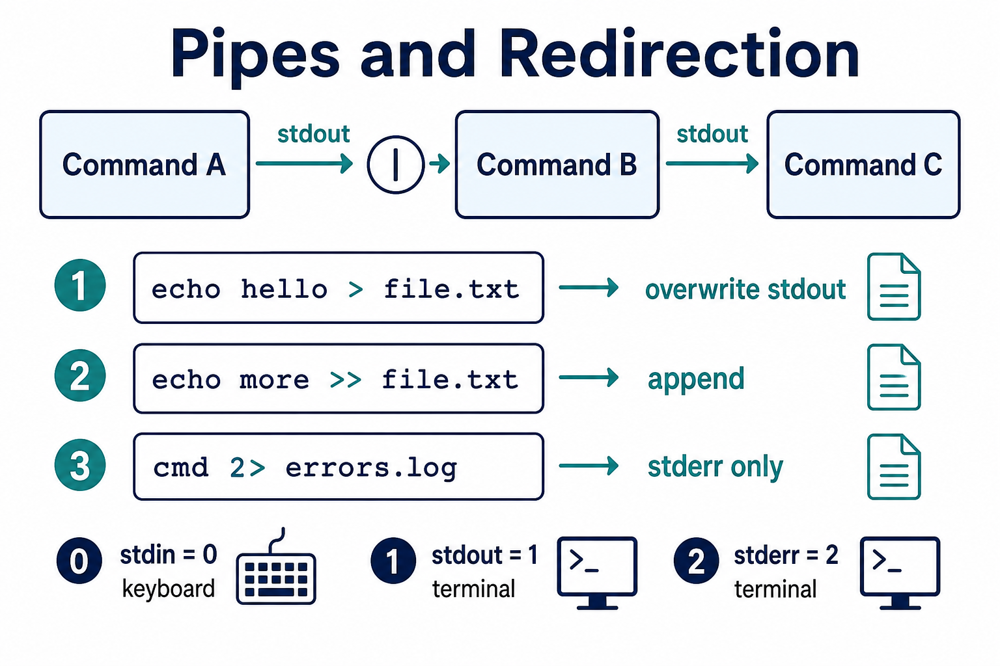

# 04 — I/O Redirection & Pipes

The power of Linux: **chain small tools**.



**Learning objectives**

- Redirect stdout and stderr to files
- Pipe one command into another
- Read a real log-filter pipeline

---

## Standard streams

| Stream | Number | Default |
| ------ | ------ | ------- |
| stdin | 0 | keyboard |
| stdout | 1 | terminal |
| stderr | 2 | terminal |

Programs print **normal output** on stdout and **errors** on stderr. That is why `cmd > out.txt` can still show errors on screen.

---

## Redirection

```bash
echo "hello" > file.txt       # stdout to file (overwrite)
echo "more" >> file.txt       # append
ls /nope 2> errors.log        # stderr to file
ls /nope > out.log 2>&1       # stdout + stderr to same file
```

| Operator | Meaning |
| -------- | ------- |
| `>` | overwrite stdout |
| `>>` | append stdout |
| `2>` | overwrite stderr |
| `2>&1` | send stderr to the same place as stdout |

---

## Pipes

```bash
ls -la | less
cat access.log | grep "404" | wc -l
ps aux | grep nginx
df -h | grep ^/dev
```

Output of the left command becomes **stdin** of the right command.

```
ps aux  →  grep nginx  →  your screen
```

---

## Here documents (useful in scripts)

```bash
cat <<EOF > config.txt
server_name localhost;
port 8080
EOF
```

---

## Real DevOps examples

```bash
# Count error lines in log
grep -c ERROR /var/log/app.log

# Top 10 IP addresses in access log (if you have one)
awk '{print $1}' access.log | sort | uniq -c | sort -rn | head

# Check if port listening
ss -tlnp | grep :80
```

---

## Common mistakes

| Pattern | Problem |
| ------- | ------- |
| `cmd > file` when you meant append | File overwritten — use `>>` |
| `grep error log \| wc` | Space around `\|` is fine; missing `\|` is not a pipe |
| `cmd > file 2>&1` vs `cmd 2>&1 > file` | Order matters — prefer `> file 2>&1` |

---

## Knowledge check

1. Difference between `>` and `>>`?
2. What does `2>` capture?
3. What does a pipe (`\|`) do?

<details>
<summary>Answers</summary>

1. `>` overwrites; `>>` appends.
2. stderr (error messages).
3. Sends stdout of the left command to stdin of the right command.

</details>

➡️ Next: [Lab 02](./Lab-02-File-Operations.md)
