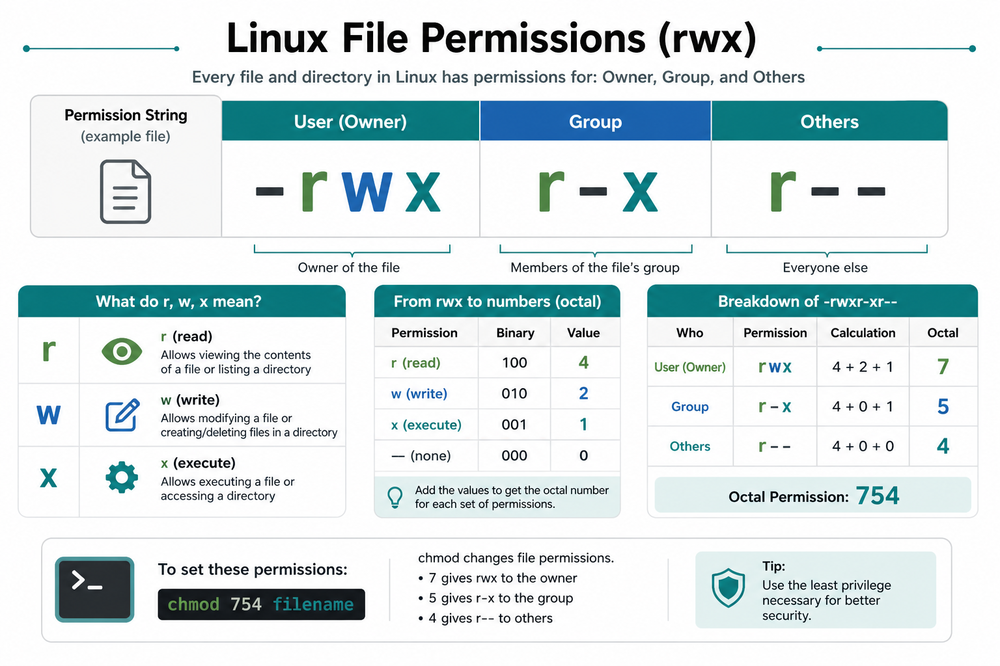

# 02 — File Permissions



**Learning objectives**

- Decode `ls -l` permission strings
- Set modes with symbolic and octal `chmod`
- Choose 644 / 755 / 600 for real files

---

## Read `ls -l`

```bash
-rwxr-xr-- 1 alice developers 4096 Jan 10 09:00 deploy.sh
│└┬┘└┬┘└┬┘
│ │  │  └── others: r--
│ │  └───── group:  r-x
│ └──────── user:   rwx
└────────── type:   - (file)
```

Three triplets: **user** (owner), **group**, **others**.

| Permission | Letter | Octal |
| ---------- | ------ | ----- |
| Read | r | 4 |
| Write | w | 2 |
| Execute | x | 1 |

Add them: `rwx` = 4+2+1 = **7**, `r-x` = 4+0+1 = **5**, `r--` = **4**, `rw-` = **6**.

So `rwxr-xr--` = **754**.

---

## chmod — symbolic

```bash
chmod u+x script.sh           # user + execute
chmod g-w file.txt            # group - write
chmod o=r file.txt            # others = read only
chmod u=rwx,g=rx,o= script.sh
```

`u` user, `g` group, `o` others, `a` all.

---

## chmod — numeric (octal)

```bash
chmod 755 script.sh    # rwxr-xr-x  (common for scripts)
chmod 644 file.txt     # rw-r--r--  (common for configs)
chmod 600 secret.key   # rw-------  (SSH private keys)
chmod 700 ~/.ssh       # rwx------  (SSH directory)
```

| Mode | Octal | Use |
| ---- | ----- | --- |
| rwxr-xr-x | 755 | executables, dirs |
| rw-r--r-- | 644 | normal files |
| rw-r----- | 640 | group-readable configs |
| rwx------ | 700 | private dir |
| rw------- | 600 | secrets and private keys |

**Directories need execute (`x`)** to `cd` into them. A dir that is `rw-rw-rw-` (666) is awkward to use.

---

## chown & chgrp

```bash
sudo chown bob:developers app.conf
sudo chown bob app.conf
sudo chgrp www-data /var/www/html -R
```

Web files often belong to `www-data` so nginx can read them.

---

## umask (default permissions)

```bash
umask
umask 022    # typical: files 644, dirs 755
```

umask **subtracts** permissions from the default. Awareness only — you will still `chmod` important files.

---

## Special bits (awareness)

| Bit | Effect |
| --- | ------ |
| setuid | Run as file owner (`/usr/bin/passwd`) |
| setgid | Run as group; dirs inherit group |
| sticky | Only owner deletes files in dir (`/tmp`) |

```bash
ls -ld /tmp    # often drwxrwxrwt  (t = sticky)
```

---

## Knowledge check

1. What octal is `rw-r--r--`?
2. What octal is a private SSH key?
3. Why do directories need `x`?

<details>
<summary>Answers</summary>

1. `644`
2. `600`
3. Execute on a directory means “enter / traverse” — without it, `cd` and path lookup fail.

</details>

➡️ Next: [03 — SSH & SCP](./03-SSH-SCP.md)
