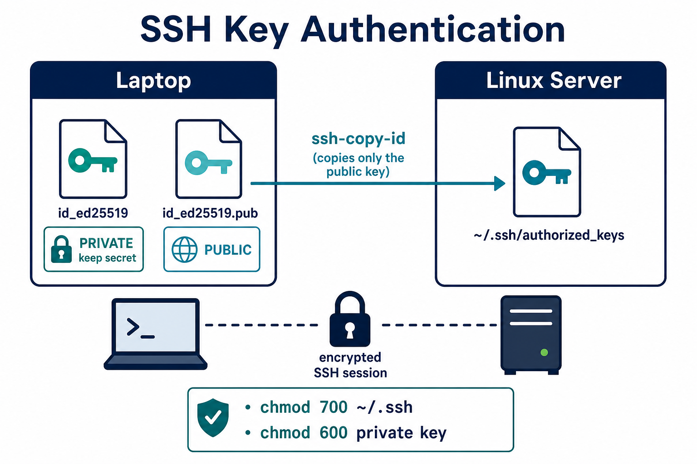

# 03 — SSH & SCP

Remote access is how you manage **every Linux server** in the cloud.



**Learning objectives**

- Log in with `ssh`
- Create a key pair and install the **public** key
- Copy files with `scp`

---

## Connect with password

```bash
ssh user@192.168.1.50
ssh user@myserver.example.com
ssh -p 2222 user@host    # custom port
exit
```

First connection asks to trust the host fingerprint — type `yes`.

---

## SSH key pair (recommended)

On your **local** machine (WSL/laptop):

```bash
ssh-keygen -t ed25519 -C "your_email@example.com"
# saves to ~/.ssh/id_ed25519 (private) and id_ed25519.pub (public)

cat ~/.ssh/id_ed25519.pub
```

| File | Share it? |
| ---- | --------- |
| `id_ed25519` | **Never** — this is the private key |
| `id_ed25519.pub` | Yes — this goes on the server |

Copy public key to server:

```bash
ssh-copy-id user@server
# or append the .pub line to ~/.ssh/authorized_keys on the server
```

Permissions matter (SSH refuses keys that are too open):

```bash
chmod 700 ~/.ssh
chmod 600 ~/.ssh/authorized_keys
chmod 600 ~/.ssh/id_ed25519
chmod 644 ~/.ssh/id_ed25519.pub
```

---

## SCP — copy files over SSH

```bash
scp localfile.txt user@server:/home/user/
scp user@server:/var/log/app.log ./logs/
scp -r myfolder/ user@server:/opt/
```

`rsync -avz -e ssh src/ user@host:dest/` is better for large/repeated copies (resume, skip unchanged).

---

## SSH config shortcut

`~/.ssh/config`:

```
Host myvm
  HostName 20.10.5.4
  User azureuser
  IdentityFile ~/.ssh/id_ed25519
```

Then: `ssh myvm`

```bash
chmod 600 ~/.ssh/config
```

---

## DevOps usage

- Azure VM, AWS EC2, GitHub Actions self-hosted runners
- Ansible, rsync, SFTP all build on SSH
- Store private keys in a password manager or CI **secret** — not in Git

---

## Knowledge check

1. Which file do you copy to the server?
2. Typical mode for a private key?
3. What does `ssh-copy-id` do?

<details>
<summary>Answers</summary>

1. The **public** key (`.pub`).
2. `600` (`chmod 600 ~/.ssh/id_ed25519`).
3. Appends your public key to the server’s `~/.ssh/authorized_keys`.

</details>

➡️ Next: [04 — Cron Jobs](./04-Cron-Jobs.md)
