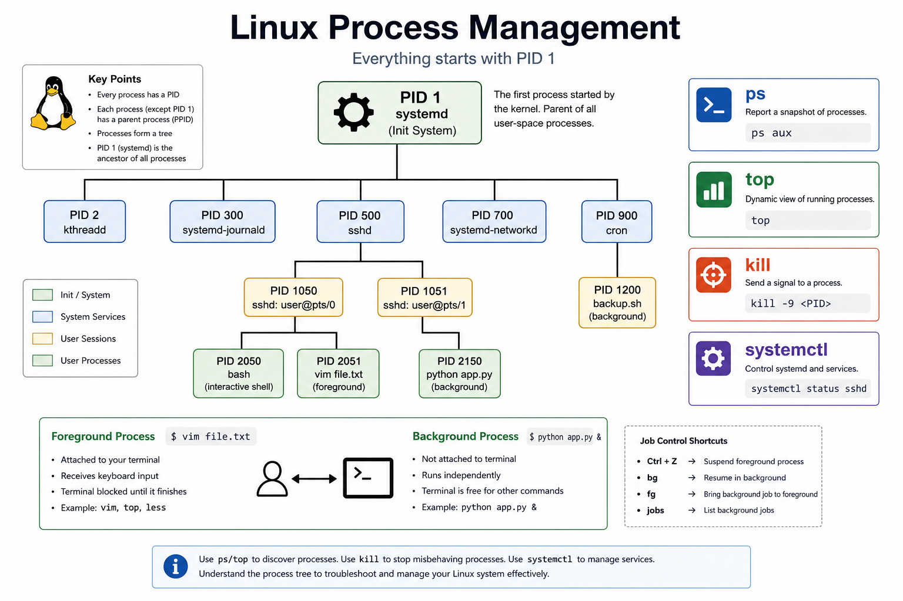

# 01 — Process Management



---

## What is a process?

A **running instance** of a program. Each process has a **PID** (Process ID).

```bash
ps                    # snapshot of your session
ps aux                # all processes (BSD style)
ps -ef                # all processes (SysV style)
top                   # live view (q to quit)
htop                  # friendlier top (install if needed)
```

---

## Key columns in `ps aux`

| Column | Meaning |
| ------ | ------- |
| USER | Who started it |
| PID | Process ID |
| %CPU / %MEM | Resource usage |
| STAT | State (R=running, S=sleep, Z=zombie) |
| COMMAND | Program name |

```bash
ps aux | grep nginx
ps aux | grep -v grep | grep ssh
```

---

## Foreground vs background

```bash
sleep 300             # blocks terminal
sleep 300 &           # runs in background
jobs                  # list background jobs
fg %1                 # bring job 1 to foreground
bg %1                 # resume stopped job in background
```

Stop with **Ctrl+Z**, then `bg` or `kill`.

---

## Signals & kill

```bash
kill 1234             # SIGTERM (graceful)
kill -9 1234          # SIGKILL (force)
killall nginx
pkill -f "python app"
```

| Signal | Number | Use |
| ------ | ------ | --- |
| SIGTERM | 15 | Ask process to stop |
| SIGKILL | 9 | Force kill (cannot be ignored) |
| SIGHUP | 1 | Reload config (many daemons) |

---

## Process tree

```bash
pstree
pstree -p             # show PIDs
systemctl status ssh  # service → main PID
```

Parent **PID 1** on modern Linux is **systemd** (replaces old `init`).

➡️ Next: [02 — System Monitoring](./02-System-Monitoring.md)
