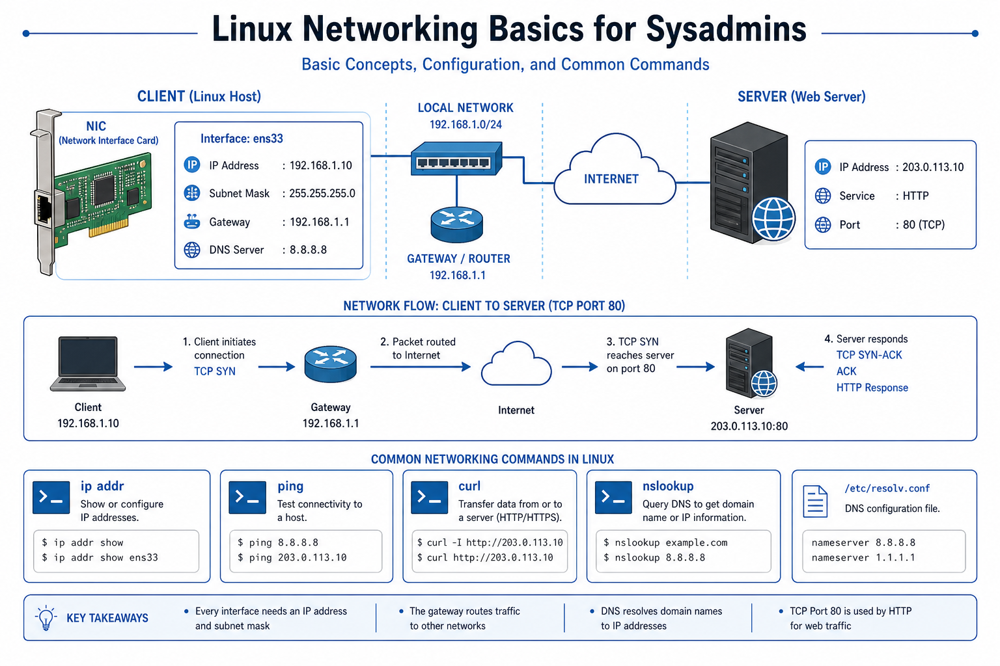

# 01 — Networking Basics



---

## IP address & interfaces

```bash
ip addr show
ip a
hostname -I
```

Common interface names: `eth0`, `ens33`, `wlan0`, `lo` (loopback 127.0.0.1).

---

## Routing

```bash
ip route
ip route show default
```

Default gateway = router that forwards traffic to the internet.

---

## Test connectivity

```bash
ping -c 4 8.8.8.8              # reach Google DNS (ICMP)
ping -c 4 google.com
curl -I https://github.com
wget -qO- https://example.com | head
```

| Result | Meaning |
| ------ | ------- |
| ping IP works, name fails | Likely **DNS** issue |
| ping fails entirely | Routing, firewall, or host down |
| curl works | HTTP/TCP path OK |

---

## Ports & listeners

```bash
ss -tulpn
sudo ss -tulpn | grep LISTEN
sudo lsof -i :22
sudo lsof -i :80
```

| Port | Typical service |
| ---- | --------------- |
| 22 | SSH |
| 80 | HTTP |
| 443 | HTTPS |
| 3306 | MySQL |

---

## Firewall (awareness)

```bash
# Ubuntu (ufw)
sudo ufw status
sudo ufw allow 22/tcp

# RHEL (firewalld)
sudo firewall-cmd --list-all
```

Cloud: also check **NSG / security groups** in Azure/AWS — OS firewall can be open while cloud blocks traffic.

➡️ Next: [02 — DNS & Troubleshooting](./02-DNS-Troubleshooting.md)
