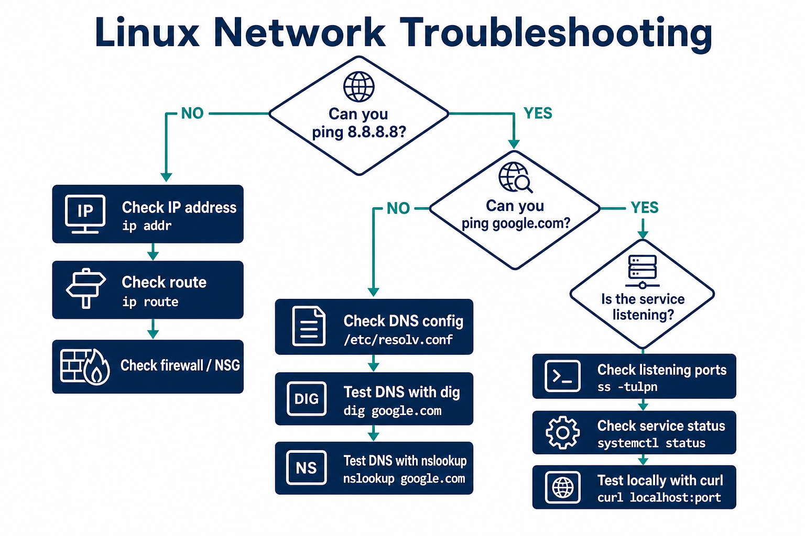

# 02 — DNS & Troubleshooting



**Learning objectives**

- Resolve a name with `dig` / `nslookup`
- Follow a fixed order: IP → DNS → service → firewall
- Map common error messages to causes

---

## What DNS does

Maps **names → IP addresses** (and more: MX, CNAME, TXT).

```bash
nslookup google.com
dig google.com
dig google.com +short
host example.com
```

---

## Resolver config

```bash
cat /etc/resolv.conf
resolvectl status                 # systemd-resolved (Ubuntu)
```

---

## Troubleshooting flow

```
Can you ping 8.8.8.8?
  NO  → check ip a, ip route, gateway, cloud NSG
  YES → Can you ping google.com?
          NO  → DNS: resolv.conf, dig, corporate DNS
          YES → Is the *service* up? ss -tulpn, systemctl, curl :port
```

Do **not** skip steps. If IP ping fails, fixing DNS will not help.

---

## Useful commands

```bash
traceroute google.com
tracepath google.com

curl -v http://localhost:80
nc -zv localhost 80               # TCP port test
```

---

## `/etc/hosts` override

```bash
cat /etc/hosts
# 127.0.0.1   localhost
# 192.168.1.10 myinternalapp.local
```

Useful in labs before DNS exists. The OS checks `/etc/hosts` **before** DNS.

---

## Real incident pattern

| Symptom | Likely cause |
| ------- | ------------ |
| SSH works by IP but not hostname | DNS or `/etc/hosts` |
| Site loads locally but not remotely | bind address, firewall, NSG |
| Connection **refused** | service down or wrong port |
| Connection **timed out** | firewall / NSG / routing |
| `Could not resolve host` | DNS |

---

## Knowledge check

1. `dig google.com +short` returns what?
2. Connection refused vs timed out?
3. Why add a name to `/etc/hosts` in a lab?

<details>
<summary>Answers</summary>

1. The IP address(es) for that name.
2. Refused = something reached the host but nothing accepted the port. Timed out = packets dropped (firewall/routing).
3. To map a fake hostname to an IP without setting up DNS.

</details>

➡️ Next: [03 — Disk & Storage](./03-Disk-Storage.md)
