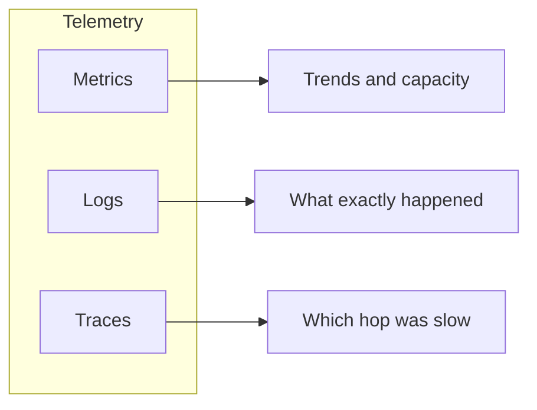

# 02 — Three pillars: metrics, logs, traces

**Learning objectives**

- Define **metric**, **log**, and **trace**
- Pick the right pillar for common incident questions
- Recognize **structured logs** vs plain text

---

## The three pillars



| Pillar | Shape | Best for | Example |
| ------ | ----- | -------- | ------- |
| **Metrics** | Numbers over time | Dashboards, alerts, capacity | `http_requests_total`, CPU % |
| **Logs** | Timestamped text (often JSON) | Errors, audit, debugging detail | `ERROR payment failed user=123` |
| **Traces** | Spans linked by trace id | Microservices, latency breakdown | checkout → pay → email |

Day 2 focuses on Azure’s view of metrics and logs. Days 3–4 go deep on Prometheus and Loki. Traces appear in **Application Insights** (Azure) and **Grafana Tempo** (not a full day in this course — you will know where they fit).

---

## Metrics (beginner mental model)

- Stored as **time series**: name + **labels** + value + timestamp.
- Types you will meet:
  - **Counter** — only goes up (requests, errors).
  - **Gauge** — up or down (memory used, queue depth).
  - **Histogram / summary** — latency buckets (p95 response time).

Prometheus uses this model; Azure Monitor metrics are similar ideas with different names.

---

## Logs

**Unstructured:**

```text
2026-03-23 10:01:02 ERROR Payment timeout order 9912
```

**Structured (preferred):**

```json
{"time":"2026-03-23T10:01:02Z","level":"ERROR","msg":"payment timeout","order_id":9912}
```

Structured logs are easier to filter in **Log Analytics (KQL)** or **Loki (LogQL)**.

---

## Traces (short intro)

One user click might call five services. A **trace** is the full path; each step is a **span** with duration.

Use traces when logs say “everything failed” but metrics say “only 2% fail” — the slow dependency hides in the middle.

---

## Which pillar first?

During an incident, teams often:

1. Check **metrics** — error rate up? latency up?
2. Search **logs** — what error message?
3. Open **traces** — which downstream call stalled?

---

## Knowledge check

1. Is “CPU 85%” a metric or a log?
2. Which pillar best answers “p95 latency doubled after deploy”?
3. Why add labels to metrics?

<details>
<summary>Answers</summary>

1. Metric (a measured number over time).
2. Metrics (histogram/summary) first; traces second for per-hop detail.
3. To split by instance, region, HTTP method, etc., without new metric names for every combo.

</details>

➡️ Next: [03 — Golden signals and SLOs](./03-Golden-Signals-and-SLOs.md)
