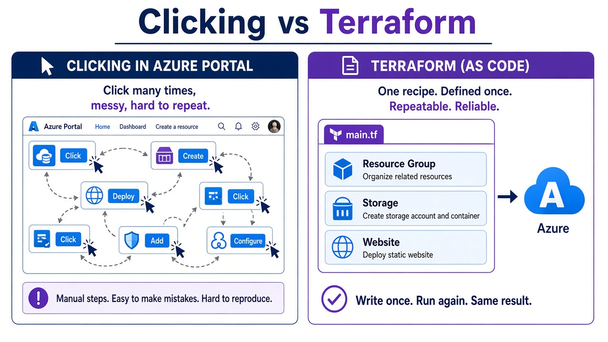

# 01 — Why Terraform

**Learning objectives**

- Say what **Infrastructure as Code (IaC)** means in one line
- Contrast clicking the Portal vs a file
- Know **declarative** vs **imperative** (you say *what*, not every click)

Ideas in this basics block match chapters 1–2 of *Terraform Basics to Advanced in One Guide* (TechOpsExamples). We teach them here in class English. Map: [From-Your-Guide.md](../Resources/From-Your-Guide.md).

---

## One-sentence idea

Terraform is a **recipe for cloud things**. Same recipe → same kitchen (Azure) → same result.

---

## Everyday analogy: cooking

| Kitchen | Cloud |
| ------- | ----- |
| Recipe on paper | `.tf` files |
| Cook follows steps | `terraform apply` |
| Friend can cook the same dish | Teammate runs the same files |
| You forget a spice | Portal click you cannot remember |

If you click 20 buttons in the Azure Portal, next week you cannot be sure you clicked the same 20.

---

## Declarative (Terraform) vs imperative (scripts)

| Style | You write | Example |
| ----- | --------- | ------- |
| **Declarative** | The **result** you want | “I want a resource group in eastus” |
| **Imperative** | The **steps** | `az group create` then another command |

Terraform is declarative. You do not list every API call. Run apply **again** → same picture (**idempotent**: twice does not make two groups).

**Azure CLI** is often imperative. Both are useful. This course is Terraform.

---

## Terraform vs Portal vs other IaC

| Tool | Simple picture |
| ---- | -------------- |
| Azure Portal | Click. Hard to repeat. |
| ARM / Bicep | Azure-only recipes |
| Terraform | One language; **providers** talk to Azure (and other clouds) |
| OpenTofu | Open-source fork (same idea; class uses Terraform) |

---

## Two parts of the machine

1. **Your files** (the wish): `providers.tf`, `main.tf`, later `variables.tf`, `outputs.tf`, `backend.tf`
2. **Terraform Core** (the brain): reads files, talks to **providers**, updates **state**

Providers are plugins from the [Terraform Registry](https://registry.terraform.io/). `terraform init` downloads them into `.terraform/`.

---

## Example

You need a **resource group** named `tfclass-rg` in `eastus`.

Portal: many clicks.

Terraform: one block. Apply. Apply again → “nothing to change.”

---

## Knowledge check

1. Does Terraform replace Azure?
2. Declarative means you write every `az` command — true or false?
3. Why is a file better than memory?

Answers

1. No. It **talks to** Azure for you.  
2. False — you write the **desired** resources.  
3. The file can be copied, reviewed, and repeated.

➡️ Next: [Lab 01A](./Lab-01A-Install.md)
