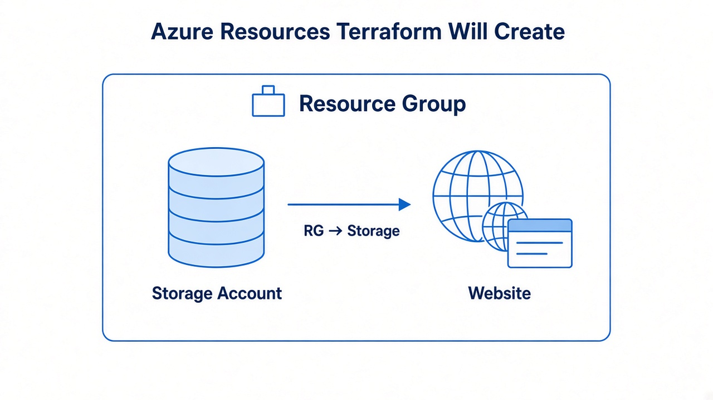

# 01 — Resources and order

**Learning objectives**

- A **resource** block = one Azure object
- Terraform **draws a graph**: storage needs the resource group first

---

## One-sentence idea

You do not write “step 1, step 2.” You **point** at other resources. Terraform orders the work.



---

## Everyday analogy: a house

You cannot hang a door before walls exist.  
`azurerm_storage_account` uses `azurerm_resource_group.main.name` — that **reference** is the “after the walls.”

---

## Example

```hcl
resource "azurerm_storage_account" "web" {
  name                     = "tfclass${random_string.suffix.result}"
  resource_group_name      = azurerm_resource_group.main.name
  location                 = azurerm_resource_group.main.location
  account_tier             = "Standard"
  account_replication_type = "LRS"
}
```

Storage names are **globally unique**. We add random letters so class does not collide.

---

## Implicit vs explicit order

**Implicit:** you use `azurerm_resource_group.main.name` inside storage. Terraform already knows “group first.”

**Explicit:** rare. `depends_on = [azurerm_resource_group.main]` when there is **no** reference but you still need order.

Prefer implicit. `depends_on` is the extra stick.

See also: `terraform graph` (prints a picture of arrows — optional at home).

---

## Knowledge check

1. Why not hard-code the resource group name in two places?
2. Is LRS expensive?

<details>
<summary>Answers</summary>

1. One source of truth — change once.  
2. Cheap; good for class. Not multi-region.

</details>

➡️ Next: [Lab 03A](./Lab-03A-Storage.md)
