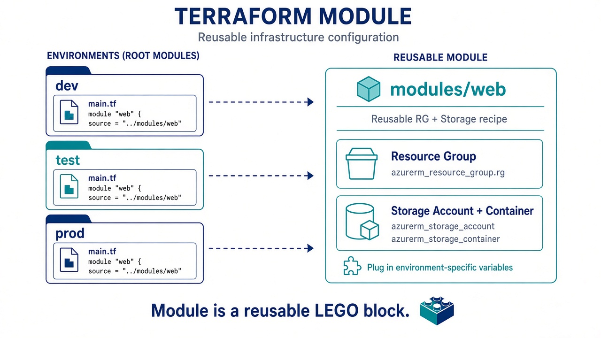

# 01 — Modules (LEGO)

**Learning objectives**

- A **module** is a folder of `.tf` files you can call many times
- Root module = the folder where you run `terraform apply`

---

## One-sentence idea

Do not copy-paste the same 40 lines for every student environment. **Call a module.**



---

## Everyday analogy: a cookie cutter

The cutter (`modules/web`) is the shape.  
`dev` and `prod` press the cutter with different names.

---

## Example

```hcl
module "web" {
  source   = "./modules/web"
  prefix   = var.prefix
  location = var.location
}
```

Inside the module: resource group + storage + blob (Day 3).  
Outside: variables + module call + outputs.

**Root module** = the folder where you type `apply`.  
**Child module** = `modules/web`.

Later you can use a module from the [public registry](https://registry.terraform.io/) (`source = "org/name/provider"` + `version`). Class uses a **local** folder first.

**Workspaces** (`terraform workspace new dev`) are another way to split **dev/prod state**. Many teams prefer **separate folders or pipelines** instead. Optional extra: [Workspaces (optional)](./03-Workspaces-Optional.md).

---

## Knowledge check

1. Does a module run by itself without a root `main.tf`?
2. Why `source = "./modules/web"`?

<details>
<summary>Answers</summary>

1. You apply from the **root**.  
2. Local path — the folder next to you in class.

</details>

➡️ Next: [Lab 04A](./Lab-04A-Module.md)
