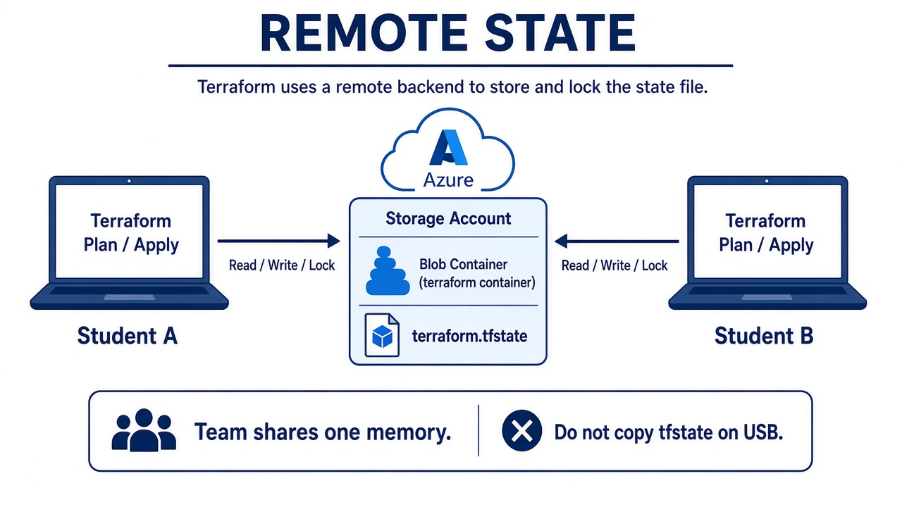

# 02 — Remote state

**Learning objectives**

- Local `terraform.tfstate` lives on **one** laptop
- **Remote state** = file in Azure Storage (or Terraform Cloud)
- Teams need one memory + a **lock** so two applies do not run together

---

## One-sentence idea

Put the notebook in a shared locker (Azure blob), not in your backpack.

---

## Chicken and egg

The storage account for state **cannot** be in the same state file the first time.  
Create it **once** with Azure CLI (Lab 04B), then point Terraform at it.

---

## Knowledge check

1. Should `terraform.tfstate` be in Git?
2. What happens if two people apply at once without a lock?

Answers

1. No.  
2. They can overwrite each other’s notebook. Backend lock helps.

➡️ Next: [Lab 04B](./Lab-04B-Remote-State.md)
