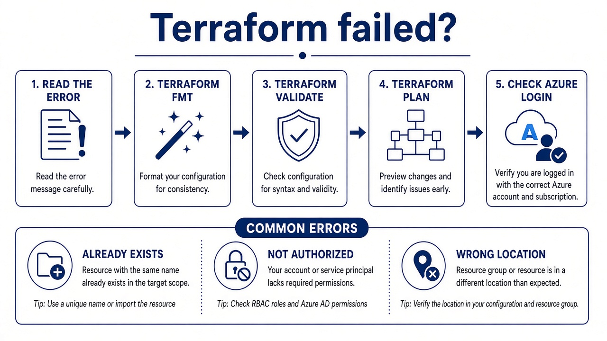

# 02 — Troubleshoot and destroy

**Learning objectives**

- A short error checklist
- **Destroy** is part of the job, not an afterthought

---

## One-sentence idea

If you created it with Terraform, **delete it with Terraform** so state stays true.



---

## Checklist

1. Read the **first** error line
2. `az account show` — right subscription?
3. Name unique?
4. `terraform fmt` / `validate`
5. `terraform plan` — unexpected destroy?

Need more detail (tutor / homework):

```bash
# bash
export TF_LOG=DEBUG
export TF_LOG_PATH=terraform-debug.log
terraform plan
```

PowerShell: `$env:TF_LOG="DEBUG"`

Levels: `ERROR`, `WARN`, `INFO`, `DEBUG`, `TRACE` (TRACE is huge).

If state and Azure disagree: `terraform apply -refresh-only` (modern) or ask the tutor before `terraform state rm`.

**Provisioners** (`local-exec` / `remote-exec`) run scripts after create. HashiCorp calls them a **last resort**. We do not use them in class.

Portal **Delete resource group** is the emergency exit. Then state is a liar until you `state rm` or start clean. Avoid it in class unless the tutor says so.

---

## Knowledge check

1. After destroy, should the Portal still show the RG?
2. What about `tfclass-state-rg`?

<details>
<summary>Answers</summary>

1. No.  
2. Delete it **last** (it holds the notebook). Empty apply destroy first, then delete the state group with CLI.

</details>

➡️ Next: [Lab 05B](./Lab-05B-Capstone.md)
