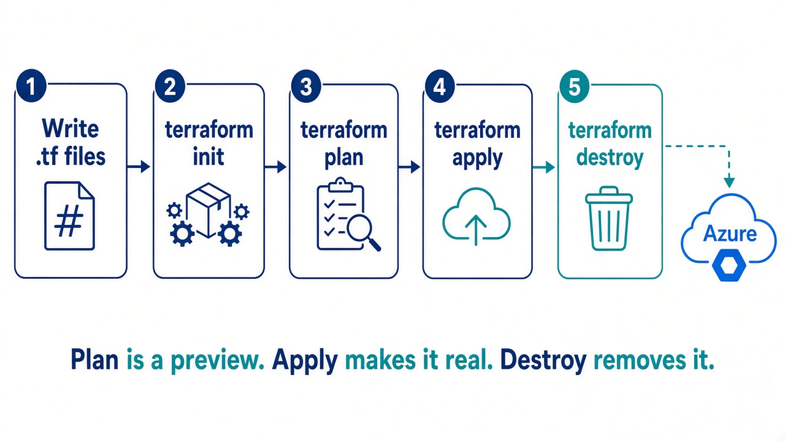
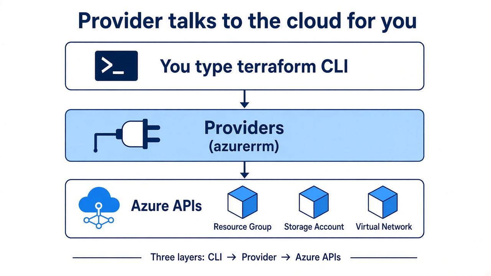

# Day 1 — Why Terraform

**Today:** install, login, create **one** resource group.

---

# Clicking vs a recipe


---

# Cooking story

Recipe = `.tf` files  
Cook = `terraform apply`  
Friend can cook the same dish next week

---

# Declarative vs click / CLI

You write **what** you want (a resource group).  
Terraform decides **how** to talk to Azure.

Run apply twice → still **one** group (idempotent).  
`az group create` is a **step**. Terraform is a **picture**.

---

# Lab 01A

`terraform version`  
`az login`  
`az account show`

---

# The four commands



**plan** does **not** create anything.  
Line to remember: `1 to add, 0 to change, 0 to destroy`.

Usual files: `providers.tf` · `main.tf` · later `variables.tf` / `outputs.tf`

---

# Provider = plug



---

# Lab 01B

Folder `Day-01/lab/`

```bash
terraform init
terraform plan
terraform apply
```

See the group in the Portal. Then `destroy` (unless tutor says keep).

---

# Recap

1. Terraform talks **to** Azure  
2. Plan = preview  
3. Change the RG name so students do not clash
