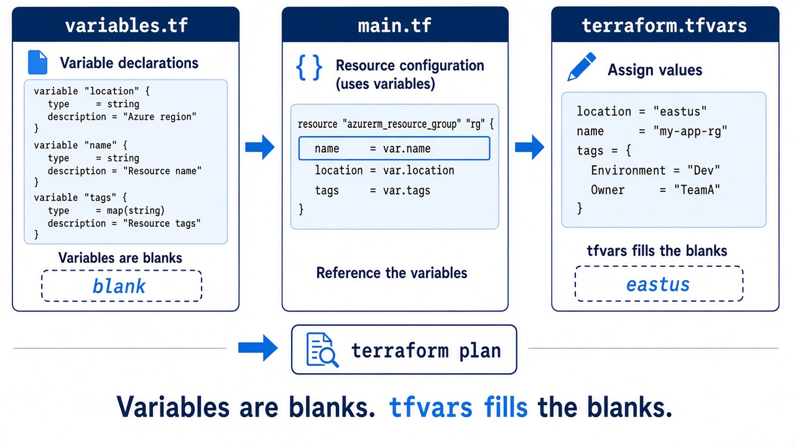
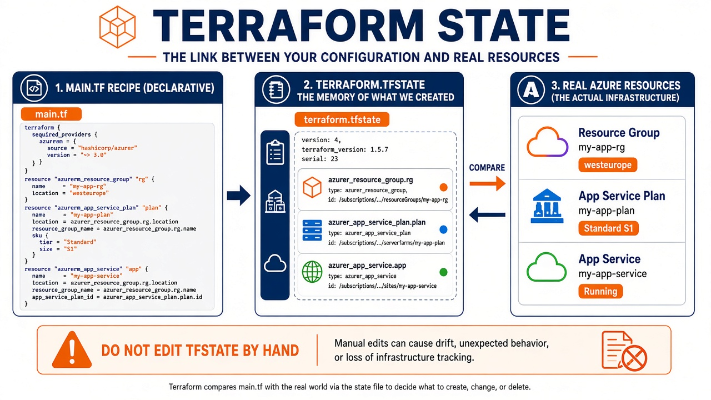

# Day 2 — Variables and state

**Today:** blanks in the form. Do not edit state by hand.

---

# Variables fill blanks



`variables.tf` = questions  
`terraform.tfvars` = answers  
`main.tf` = the letter  
`-var` / `TF_VAR_` beat `default`

---

# Lab 02A

Edit `terraform.tfvars`  
`terraform plan` / `apply`  
Change a **tag**, plan again → **1 to change**

---

# State = memory



Wish = `.tf`  
Notebook = `.tfstate`  
Reality = Azure

---

# Lab 02B

```bash
terraform output
terraform state list
terraform state show azurerm_resource_group.main
```

Never Notepad the `.tfstate` file.

---

# Recap

1. No secrets in Git  
2. State is not Azure itself  
3. Two laptops need **remote** state (Day 4)
